# Lab 0 : Environment Set-Up Report

## Student Information
- Name: Muhammad Afiq Farhan bin Mohd Nasaruddin
- Course: IKB42603 Cloud Computing Security Essentials 
- Lab Task: Lab 0 - Environment Setup
- Lecturer Name: Nor Adani Kamal Mohamad Nasir

## Overview
This report documents the setup and verification of the required local development environment for Lab 0. The purpose of this lab was to prepare a working local system that can support containerization, cloud command-line interaction, Kubernetes-based development, and local AWS service simulation. A successful environment setup is essential because modern cloud and DevOps tasks often depend on these tools being installed correctly and functioning together. In this lab, the environment was prepared by installing and validating Docker, AWS CLI v2, Kind, kubectl, OpenSSL, oathtool, and LocalStack. Each tool was tested using terminal commands and supported by screenshots as evidence of successful installation and verification.

## Objectives
The objectives of this lab are:
- Install and verify Docker for container-based development and container management.
- Install and verify AWS CLI v2 so that AWS services can be managed from the terminal.
- Install and verify Kind and kubectl to support local Kubernetes cluster creation and management.
- Install and verify helper utilities such as OpenSSL and oathtool for secure communication and authentication-related tasks.
- Start, verify, and manage LocalStack locally to simulate AWS services without requiring a real AWS account.
- Configure AWS CLI for LocalStack and confirm that the system is ready for local cloud-based testing.
- Record the installation process clearly and provide evidence through screenshots and command outputs.

---

## Step 1: Install and Verify Docker
Docker is a platform used to build, run, and manage containers. It is an important tool in cloud computing and DevOps because it allows applications to be packaged in a portable way and run consistently across different environments. In this lab, Docker was installed to prepare the system for container-based development and to ensure that the environment could support future cloud and Kubernetes-related tasks.

### Purpose
- Install Docker Engine on the local environment.
- Verify that Docker is available and functioning properly from the terminal.
- Confirm that the system is ready to run container-based applications.

### Terminal Commands
```bash
sudo apt-get update
sudo apt-get install -y docker.io
sudo systemctl enable docker
sudo systemctl start docker
docker --version
```

### Explanation of the Commands
- sudo apt-get update updates the system package list so that Docker can be installed from the latest available repository sources.
- sudo apt-get install -y docker.io installs the Docker engine package.
- sudo systemctl enable docker ensures that Docker starts automatically when the system boots.
- sudo systemctl start docker starts the Docker service immediately.
- docker --version confirms the installed Docker version.
- docker info provides system-level information to verify that Docker is running correctly.

### Evidence
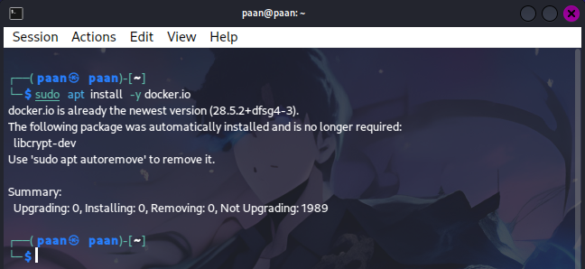

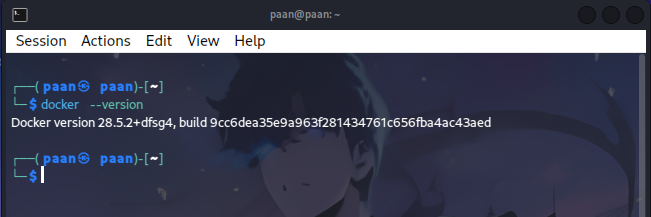

### Notes
The installation was completed successfully, and Docker was verified from the terminal using both version and system information commands. This confirms that Docker is installed and operational on the local machine.

---

## Step 2: AWS CLI v2 Installation and Verification
AWS CLI v2 is a command-line tool that allows users to interact with AWS services directly from the terminal. It is useful for managing cloud resources, checking service status, and automating cloud tasks. In this lab, AWS CLI was installed so that later steps could connect to LocalStack and test AWS-related commands locally without using the full cloud environment.

### Purpose
- Install AWS CLI v2 on the system.
- Verify that the CLI is installed and accessible from the command line.
- Prepare the environment for future AWS and LocalStack interaction.

### Terminal Commands
```bash
curl "https://awscli.amazonaws.com/awscli-exe-linux-x86_64.zip" -o "awscliv2.zip"
unzip awscliv2.zip
sudo ./aws/install
aws --version
```

### Explanation of the Commands
- curl downloads the AWS CLI installation package from the official AWS source.
- unzip extracts the downloaded archive so the installation files can be used.
- sudo ./aws/install installs AWS CLI v2 on the system.
- aws --version confirms that the installation completed successfully and displays the installed version.

### Evidence
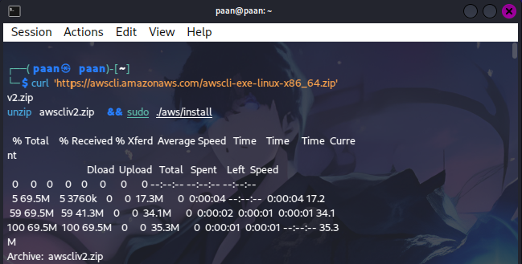

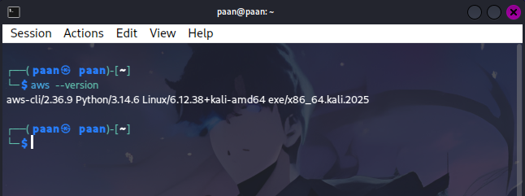

### Notes
AWS CLI v2 was successfully installed and verified through the terminal version command. This confirms that the system is ready to interact with AWS services and LocalStack.

---

## Step 3: Install and Verify Kind and Kubectl
Kind is a tool that allows users to run local Kubernetes clusters using Docker containers. It is commonly used in development and testing because it provides a lightweight and practical way to simulate a Kubernetes environment without needing a full cloud cluster. kubectl is the command-line client used to interact with Kubernetes clusters, including creating resources and checking cluster status. Together, these tools are important for working with container orchestration in a local environment.

### Purpose
- Install Kind for easy local Kubernetes cluster creation.
- Install kubectl for managing Kubernetes clusters from the terminal.
- Verify both tools to ensure they are ready for use.

### Terminal Commands
```bash
curl -Lo ./kind https://kind.sigs.k8s.io/dl/v0.20.0/kind-linux-amd64
chmod +x ./kind
sudo mv ./kind /usr/local/bin/kind
kind --version

sudo apt install kubectl
chmod +x kubectl
sudo mv kubectl /usr/local/bin/kubectl
kubectl version --client
```

### Explanation of the Commands
- curl -Lo ./kind downloads the Kind binary from the official release page.
- chmod +x ./kind makes the downloaded file executable.
- sudo mv ./kind /usr/local/bin/kind installs Kind so that it can be used anywhere in the terminal.
- kind --version verifies that Kind is installed correctly.
- curl -LO downloads the kubectl binary for the latest stable Kubernetes release.
- chmod +x kubectl and sudo mv kubectl /usr/local/bin/kubectl install kubectl system-wide.
- kubectl version --client checks that kubectl is installed and working.

### Evidence
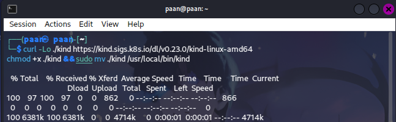

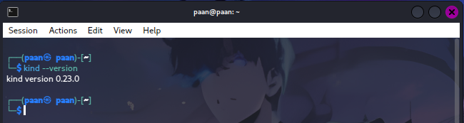

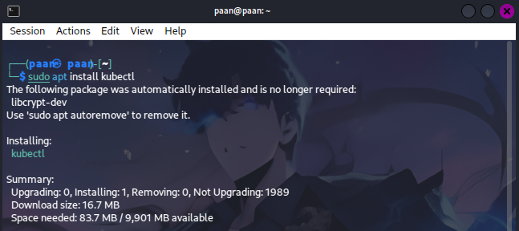

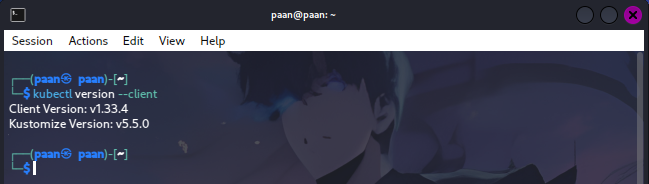

### Notes
Both Kind and kubectl were installed successfully and verified from the terminal. This confirms that the local Kubernetes environment is ready for use.

---

## Step 4: Install and Verify Helper Tools
OpenSSL and oathtool are lightweight but important utilities used in security-related and authentication-related tasks. OpenSSL is commonly used for generating keys, handling certificates, and performing encryption-related operations. oathtool is used for generating and validating one-time passwords (OTPs), which are often used in two-factor authentication systems. These tools are useful because secure systems often require cryptographic and authentication support during development and testing.

### Purpose
- Install OpenSSL for encryption and certificate-related tasks.
- Install oathtool for generating or validating one-time passwords.
- Verify both tools from the terminal to confirm they are available.

### Terminal Commands
```bash
sudo apt-get install -y openssl oathtool
openssl version
oathtool --version
```

### Explanation of the Commands
- sudo apt-get install -y openssl oathtool installs both helper tools in one command.
- openssl version verifies the OpenSSL installation and displays the version number.
- oathtool --version verifies the oathtool installation and displays the version number.

### Evidence
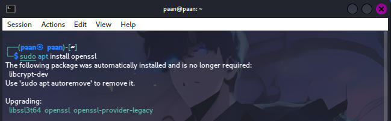

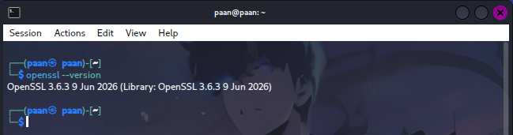

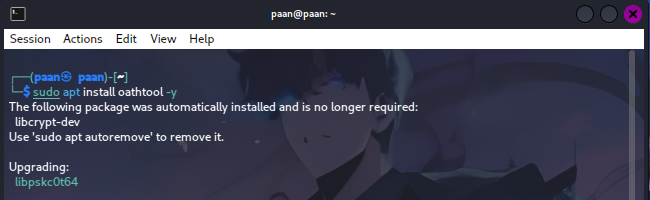

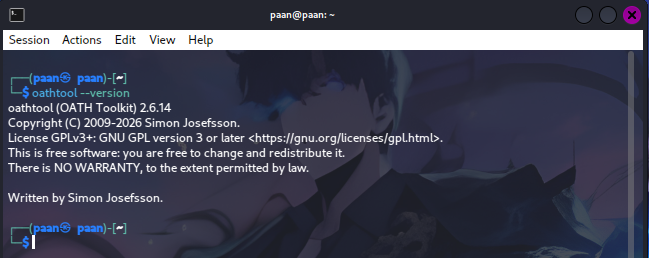

### Notes
The required helper tools were installed successfully and confirmed through their version outputs. Their availability strengthens the overall development environment and supports secure testing activities.

---

## Step 5: Start and Verify LocalStack
LocalStack is a powerful tool used to emulate AWS services locally. It allows developers to test cloud applications without needing to connect to the real AWS cloud. This is especially useful for learning, development, and testing because it reduces cost and risk while still providing a realistic environment for AWS-based workflows. In this step, a local Kubernetes cluster was also created and verified using Kind, while LocalStack was started and checked to confirm that AWS-like services could be simulated locally.

### 5.1 Kubernetes Cluster Setup with Kind
Kind was used to create and verify a local Kubernetes cluster, which is important for testing container orchestration in a lightweight environment.

#### Terminal Commands
```bash
kind create cluster --name ccse
kubectl cluster-info --context kind-ccse
kubectl get nodes
kind delete cluster --name ccse
```

#### Explanation of the Commands
- kind create cluster --name ccse creates a local Kubernetes cluster named ccse.
- kubectl cluster-info displays information about the active Kubernetes cluster.
- kubectl get nodes shows the nodes that are currently available in the cluster.
- kind delete cluster --name ccse removes the cluster when it is no longer required.

#### Evidence
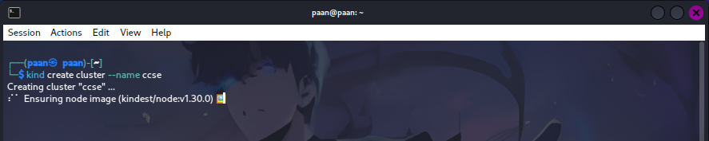

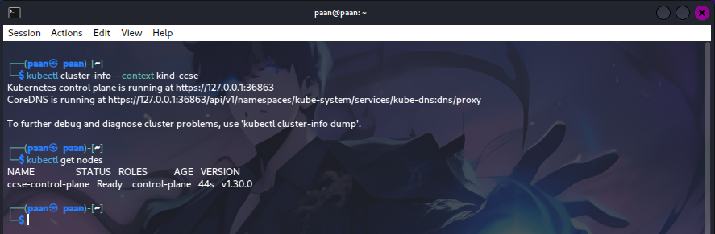

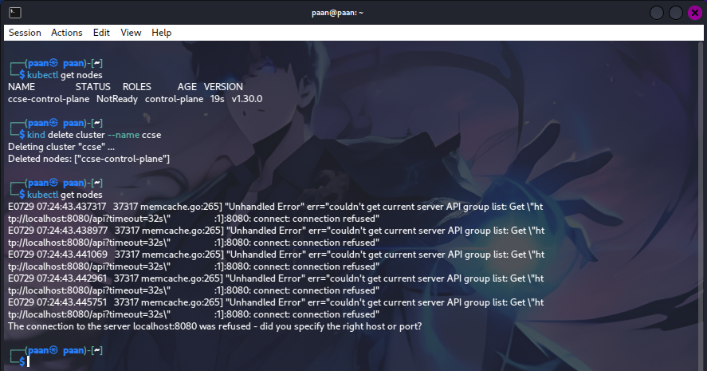

### 5.2 LocalStack Start, Verify, and Management
LocalStack was started locally and verified through terminal and browser-based checks. This demonstrates that the local AWS simulation environment was working as intended.

#### Terminal Commands
```bash
# Start LocalStack (new container)
sudo docker run -d \
--name localstack \
-p 4566:4566 \
localstack/localstack:3.0

# Start LocalStack (existing container)
sudo docker start localstack

# List all containers (including stopped ones)
sudo docker ps -a

# Check if LocalStack is running
sudo docker ps

# Stop LocalStack
sudo docker stop localstack

# Remove LocalStack container (force delete if needed)
sudo docker rm -f localstack
```

#### Explanation of the Commands
- docker run → Creates and starts a new LocalStack container in the background (-d = detached mode).
- docker start → Starts an existing LocalStack container that was previously created.
- docker ps -a → Lists all containers (running and stopped).
- docker ps → Shows only currently running containers.
- docker stop → Stops the LocalStack container.
- docker rm -f → Removes the LocalStack container; -f forces removal even if it’s running.

#### Evidence
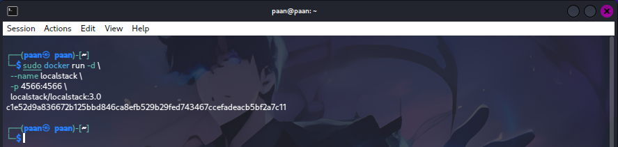

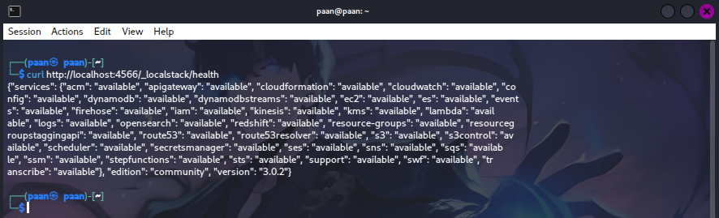

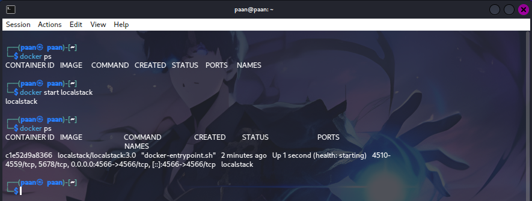

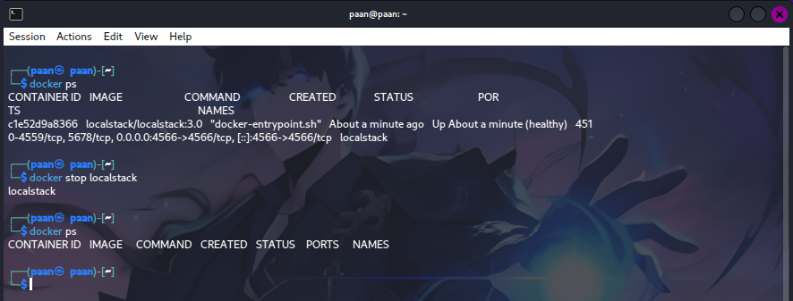

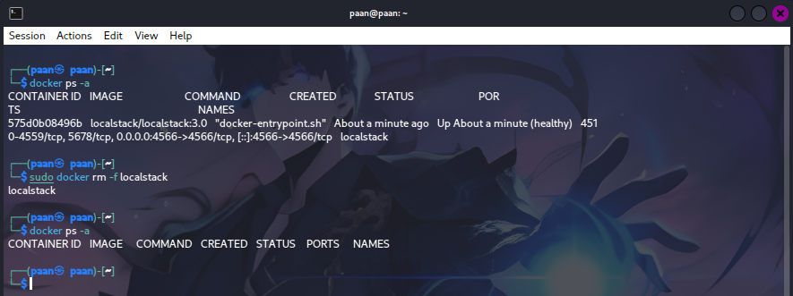

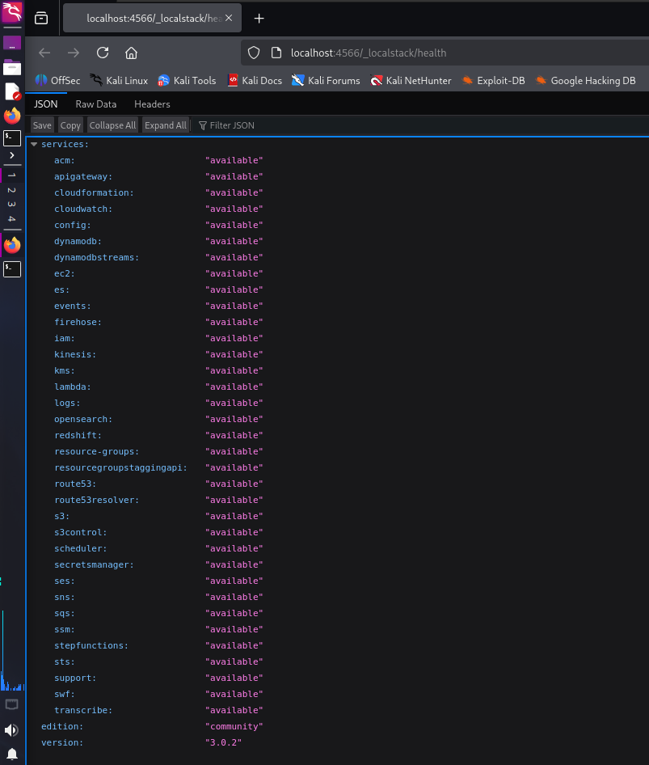

### Notes
The Kubernetes cluster was created and verified successfully, and LocalStack was started and confirmed to be running locally. The service can also be stopped and removed when required, which is useful for maintaining a clean development environment.

---

## Step 6: Configure AWS CLI for LocalStack
Configuring AWS CLI for LocalStack is an important step because it allows command-line AWS operations to be directed to the local simulation environment rather than the real AWS cloud. This setup is useful because it enables developers to test AWS-related commands safely and efficiently without requiring live cloud resources. In this lab, AWS CLI was configured using dummy credentials and a local region setting so that it could communicate with LocalStack.

### Purpose
- Configure AWS CLI credentials and region for LocalStack.
- Prepare the environment for local AWS service testing.
- Ensure that AWS CLI can send requests to a local mock service.

### Terminal Commands
```bash
aws configure set aws_access_key_id test
aws configure set aws_secret_access_key test
aws configure set region us-east-1
EP='--endpoint-url=http://localhost:4566'
aws $EP sts get-caller-identity     
```

### Explanation of the Commands
- aws configure starts the interactive AWS CLI configuration process.
- The access key and secret access key are set to test values for LocalStack use.
- The region is set to us-east-1, which is commonly used for local testing.
- The output format is set to json to make command results easier to read and process.

### Evidence
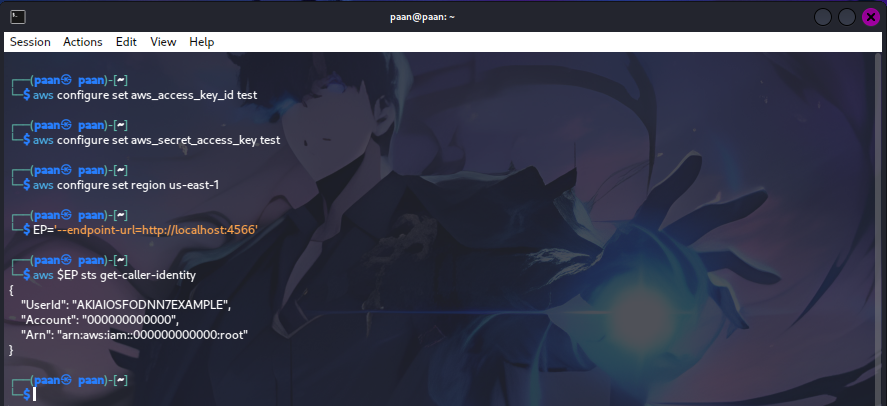

### Notes
The AWS CLI was configured successfully for LocalStack use. This setup ensures that local AWS commands can be executed in a controlled environment for testing and learning purposes.

---

## Pre-Lab Verification Checklist
The following checklist was verified based on the lab results and screenshots:

- > [✓] Docker installed and verified.
- > [✓] Docker version confirmed.
- > [✓] AWS CLI v2 installed and verified.
- > [✓] Kind installed and verified.
- > [✓] kubectl installed and verified.
- > [✓] OpenSSL installed and verified.
- > [✓] oathtool installed and verified.
- > [✓] LocalStack started successfully.
- > [✓] LocalStack verified locally.
- > [✓] AWS CLI configured for LocalStack.
- > [✓] Kubernetes cluster operations verified with Kind.

---

## Summary Table

| Item | Tool / Service | Version / Details | Status | Evidence |
|---|---|---|---|---|
| Container runtime | Docker | Docker version 28.5.2+dfsg4 | Completed | img/1-docker-installed.png, img/1-docker-version.png |
| Cloud CLI | AWS CLI v2 | aws-cli/2.36.9 | Completed | img/2-aws-installed.png, img/2-aws-version.png |
| Kubernetes tool | Kind | kind version 0.23.0 | Completed | img/3-kind-Installed.png, img/3-kind-version.png |
| Kubernetes CLI | kubectl | Client version v1.33.4, Kustomize v5.5.0 | Completed | img/3-kubectl-Installed.png, img/3-kubectl-version.png |
| Helper utility | OpenSSL | OpenSSL 3.6.3 | Completed | img/4-openssl-Installed.png, img/4-openssl-version.png |
| Helper utility | oathtool | oathtool (OATH Toolkit) 2.6.14 | Completed | img/4-oathtool-Installed.png, img/4-oathtool-version.png |
| Local AWS platform | LocalStack | Started, verified, and managed locally | Completed | img/5-localstack-start.png, img/5-localstack-verify.png |
| Kubernetes cluster | Kind cluster | Created and checked successfully | Completed | img/5-kubernetes-cluster-kind-check.png, img/5-kubernetes-cluster-kind-create.png |
| AWS CLI config | LocalStack config | Configured for local AWS testing | Completed | img/6-one-time-aws-cli-confg.png |

---

## Conclusion
The environment setup for Lab 0 was completed successfully. All required tools were installed, verified, and configured for local development and testing. The setup included Docker, AWS CLI v2, Kind, kubectl, OpenSSL, oathtool, and LocalStack, and the verification process was supported by screenshots and terminal output.
