# Lab 1: Account Security and IAM Report

## Student Information
- Name: Muhammad Afiq Farhan bin Mohd Nasaruddin
- Course: IKB42603 Cloud Computing Security Essentials
- Lab Task: Lab 1 - Account Security and IAM
- Lecturer Name: Nor Adani Kamal Mohamad Nasir

## Overview
This report documents the completion of Lab 1 on cloud account security, identity, and access management. The lab used LocalStack to simulate AWS IAM behavior and a local Kubernetes cluster to demonstrate RBAC authorization. The objective was to show how identity and permissions can be managed securely through least-privilege design, role-based access control, and proper credential hygiene.

## Objectives
The objectives of this lab are:
- Understand the relationship between cloud identity, permissions, and access control.
- Create and manage IAM users, groups, policies, and access keys in LocalStack.
- Apply least-privilege principles to limit access and reduce risk.
- Demonstrate Kubernetes RBAC using roles, role bindings, and service accounts.
- Test authorization behavior and document the results clearly.

## Lab Summary
This lab was completed using two environments:
- LocalStack IAM on localhost:4566 to simulate AWS IAM users, groups, policies, and access keys.
- A local kind Kubernetes cluster named ccse-lab1 to demonstrate RBAC in namespaces.

## Environment and Prerequisites
The lab was carried out in a local learning environment with the following requirements:
- AWS CLI configured to communicate with LocalStack.
- A local Kubernetes cluster created with kind.
- Access to terminal commands for validation and documentation.
- Screenshot evidence stored in the img folder for reference.

---

## Session A (Week 1): Cloud Identity with LocalStack

### One-Time Environment Setup
The environment was prepared by confirming Docker, starting LocalStack, and pointing the AWS CLI to the LocalStack endpoint.

#### Commands
```bash
# 1. Confirm Docker is installed and running
docker --version

# 2. Start LocalStack in a container
sudo docker run --rm \
    --name localstack \
    -p 4566:4566 \
    localstack/localstack:3.0

# 3. Confirm LocalStack health
curl http://localhost:4566/_localstack/health
```

```bash
# Configure dummy credentials for LocalStack
aws configure set aws_access_key_id test
aws configure set aws_secret_access_key test
aws configure set region us-east-1

# Test the connection to LocalStack
aws --endpoint-url=http://localhost:4566 sts get-caller-identity
```

#### Evidence
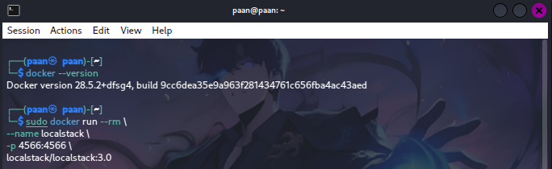

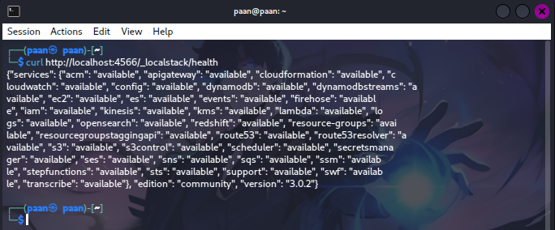

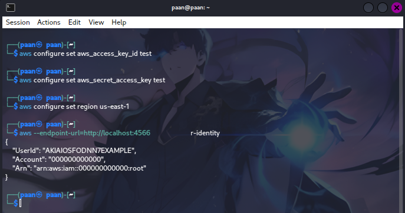

---

## Task 1: Map the Cloud Identity Landscape
The following concepts were used to understand cloud identity management:

| Concept | AWS Term | Purpose |
|---|---|---|
| All-powerful owner | Root user | The original account owner with full control over all resources and billing. It should be protected and not used for daily administration. |
| Human or application identity | IAM User | A named identity for a person, application or service that needs credentials to access cloud resources. |
| Permission bundle | IAM Policy | A JSON document that defines allowed or denied actions on specific resources. |
| Collection of users | IAM Group | A way to manage permissions for multiple users together. |
| Temporary identity | IAM Role | An identity that can be assumed temporarily to grant short-lived permissions. |

---

## Task 2: Create a Least-Privilege Admin (Purpose: To Stop Using Root)
The root account is a liability, so a dedicated admin identity was created and permissions were granted through a group rather than directly to the user.

### Step 2.1: Create Admins Group
```bash
EP='--endpoint-url=http://localhost:4566'
aws $EP iam create-group --group-name Admins
```

### Step 2.2: Attach Administrator Policy to the Group
```bash
aws $EP iam attach-group-policy --group-name Admins \
    --policy-arn arn:aws:iam::aws:policy/AdministratorAccess
```

### Evidence
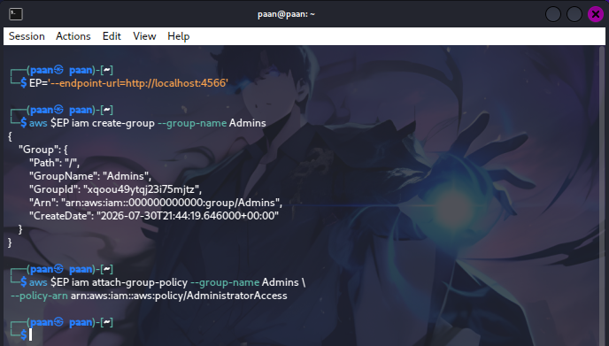

### Step 2.3: Create Personal Admin User
```bash
aws $EP iam create-user --user-name CloudAdmin_Paan
```

### Step 2.4: Add User to Admins Group and Verify Membership
```bash
aws $EP iam add-user-to-group --group-name Admins \
    --user-name CloudAdmin_Paan
```

The membership was verified afterward to confirm that the admin permissions were inherited through the group.

### Evidence
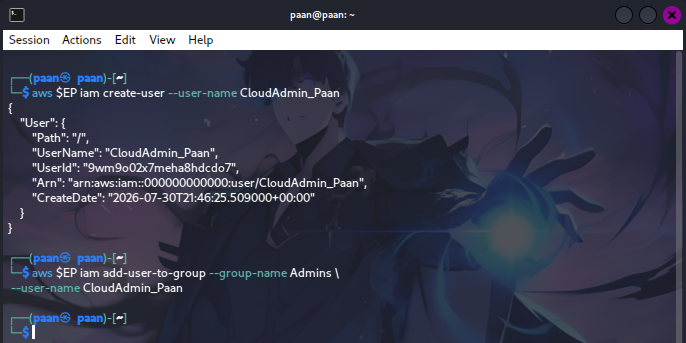

---

## Task 3: Enforce Least Privilege with a Scoped Policy
A read-only analyst user was created to demonstrate fine-grained authorization and limit the impact if that account were compromised.

### Step 3.1: Create Read-Only Analyst User
```bash
aws $EP iam create-user --user-name Analyst_Cendol
```

### Step 3.2: Attach S3 Read-Only Policy
```bash
aws $EP iam attach-user-policy --user-name Analyst_Cendol \
    --policy-arn arn:aws:iam::aws:policy/AmazonS3ReadOnlyAccess
```

### Step 3.3: Verify Analyst Permissions
```bash
aws $EP iam list-attached-user-policies --user-name Analyst_Cendol
```

### Evidence
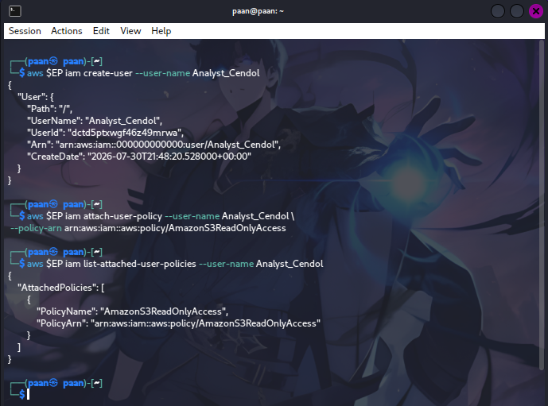

### Least-Privilege Explanation
If the Analyst_Cendol account were stolen, the damage would be limited because the account only has read-only access to S3. This reduces the blast radius compared with a stolen admin account, because the attacker cannot easily create users, modify policies, or delete resources.

---

## Task 4: Credential Hygiene and Access Keys
Programmatic access uses access keys. The lab created an access key and demonstrated key rotation and deactivation.

### Step 4.1: Create an Access Key
```bash
aws $EP iam create-access-key --user-name Analyst_Cendol
```

### Step 4.2: List Access Keys
```bash
aws $EP iam list-access-keys --user-name Analyst_Cendol
```

### Step 4.3: Rotate and Deactivate the Old Key
```bash
aws $EP iam update-access-key --user-name Analyst_Cendol \
    --access-key-id <PASTE_KEY_ID> --status Inactive
```
Redo Step 4.2 to verify the change.

### Evidence
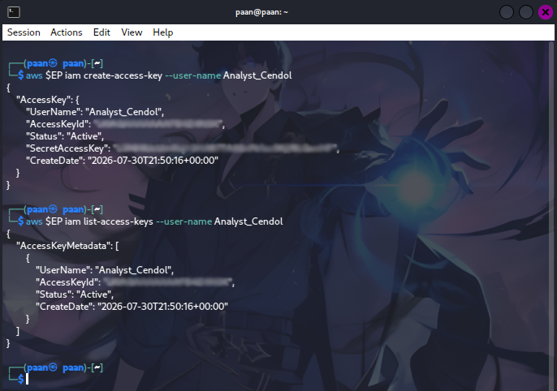

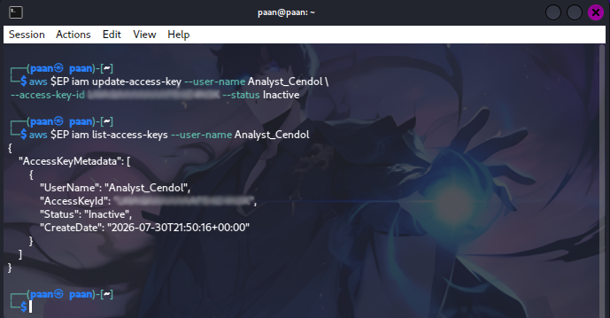

> Security note: In real AWS, access keys should not be committed to repositories, shared in screenshots, or left active longer than necessary.

---

## Session B (Week 2): Enforced Access Control with Kubernetes RBAC

### Setup: Create a Local Kubernetes Cluster
A local kind cluster was created to demonstrate how Kubernetes RBAC enforces authorization decisions.

#### Commands
```bash
kind create cluster --name ccse-lab1
kubectl cluster-info --context kind-ccse-lab1
kubectl get nodes
```

#### Evidence
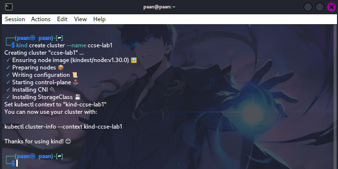

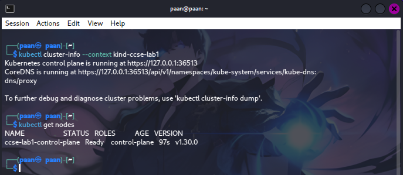

---

## Task 5: Separate Environments with Namespaces
Namespaces were created to isolate development and production workloads.

```bash
kubectl create namespace dev
kubectl create namespace prod
kubectl get namespaces
```

### Evidence
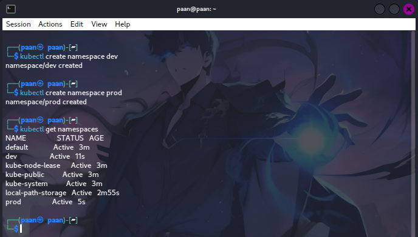

---

## Task 6: Define a Role and Bind It (Least Privilege)
A Role and RoleBinding were created so that a service account could read pods only in the dev namespace.

### Step 6.1: Create a Service Account
```bash
kubectl create serviceaccount dev-user -n dev
```

### Step 6.2: Create a Pod Reader Role
```bash
kubectl create role pod-reader -n dev \
    --verb=get,list,watch --resource=pods
```

### Step 6.3: Create a RoleBinding
```bash
kubectl create rolebinding dev-user-binding -n dev \
    --role=pod-reader --serviceaccount=dev:dev-user
```

### Evidence
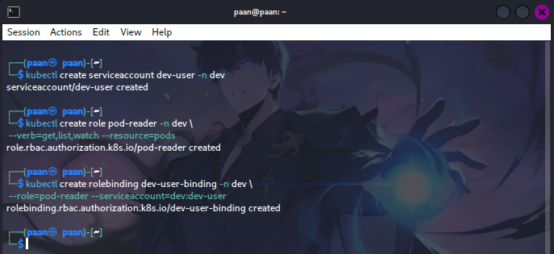

---

## Task 7: Test That Access Control Works
The service account identity was represented as:

```bash
SA=system:serviceaccount:dev:dev-user
```

### Test 1: List Pods in Dev
```bash
kubectl auth can-i list pods -n dev --as=$SA
```

Result:
```text
yes
```

### Test 2: Delete Pods in Dev
```bash
kubectl auth can-i delete pods -n dev --as=$SA
```

Result:
```text
no
```

### Test 3: List Pods in Prod
```bash
kubectl auth can-i list pods -n prod --as=$SA
```

Result:
```text
no
```

These results showed that the permissions were granted only where intended and did not extend beyond the dev namespace.

### Evidence
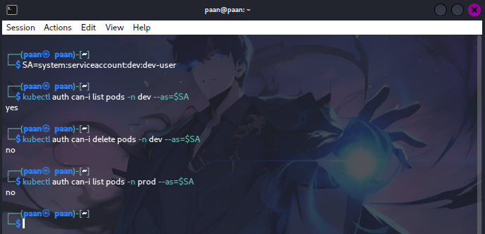

### Authentication vs Authorization
The service account passed authentication because Kubernetes recognized its identity. Authorization then decided whether the requested action was permitted. Deleting pods in dev and listing pods in prod were blocked because those actions were not allowed by the Role and RoleBinding.

---

## Verification Command
The following command was used to verify that the RBAC binding was in place:

```bash
kubectl get rolebinding dev-user-binding -n dev -o yaml
```

### Evidence
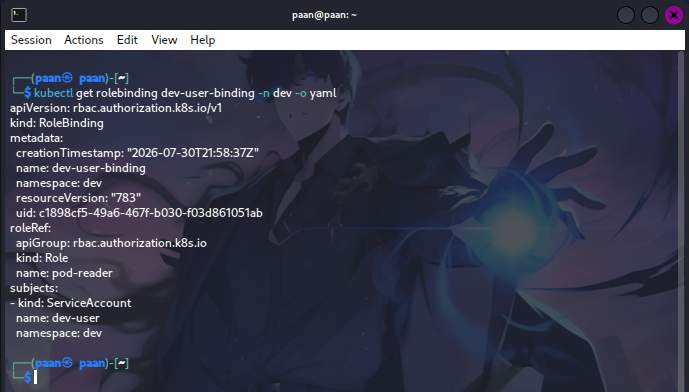

---

## Short-Answer Questions

### Q1. Why is attaching policies to groups better than attaching them directly to users?
Attaching policies to groups is better because permissions become easier to manage and audit. When many users need the same access, the policy only needs to be changed once at the group level.

### Q2. What is the difference between an IAM User and an IAM Role?
An IAM User is a long-term identity typically used by a person or application and may have long-lived credentials. An IAM Role is an assumable identity that provides temporary credentials and is safer for applications or services.

### Q3. Explain least privilege using the Analyst account, and how it reduces blast radius if compromised.
The Analyst_Cendol account demonstrates least privilege because it only has the AmazonS3ReadOnlyAccess policy. If the account is compromised, the attacker is limited to read-only S3 actions instead of gaining full administrative control.

### Q4. In Kubernetes, what is the difference between a Role and a RoleBinding?
A Role defines what actions are allowed within a namespace. A RoleBinding defines which identity receives those permissions.

### Q5. Why did the developer service account fail to access prod, and which security principle does that demonstrate?
The service account failed to access prod because the Role and RoleBinding were created only in the dev namespace. This demonstrates least privilege and environment separation.

---

## Security Best-Practices Checklist
- [x] Root user is not used for daily tasks because a dedicated admin identity exists.
- [x] Permissions are granted through groups and roles rather than directly to individual users.
- [x] A least-privilege read-only identity was created and tested.
- [x] Access keys were listed and a rotation/deactivation process was demonstrated.
- [x] Kubernetes RBAC blocked unauthorized actions and restricted access to the correct namespace.

---

## Cleanup and Teardown
```bash
kind delete cluster --name ccse-lab1
docker stop localstack
```

### Evidence
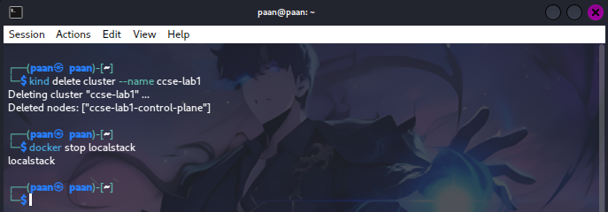

---

## Expansion Ideas (Advanced Students)
The following advanced extension ideas can be explored to deepen understanding of identity and access control beyond the basic lab tasks:

### 1. Infrastructure as Code with Terraform

Instead of creating IAM resources manually with the AWS CLI, the entire Session A setup can be recreated using Terraform pointed at LocalStack.

### Prerequisites

```bash
# Install Terraform (if not already installed)
terraform -version
```

### Terraform Configuration `main.tf`

```bash
terraform {
  required_providers {
    aws = {
      source  = "hashicorp/aws"
      version = "~> 5.0"
    }
  }
}

provider "aws" {
  access_key                  = "test"
  secret_key                  = "test"
  region                      = "us-east-1"
  skip_credentials_validation = true
  skip_metadata_api_check     = true
  skip_requesting_account_id  = true

  endpoints {
    iam = "http://localhost:4566"
  }
}

# Create the Admins group
resource "aws_iam_group" "admins" {
  name = "Admins"
}

# Attach AdministratorAccess policy to the group
resource "aws_iam_group_policy_attachment" "admin_policy" {
  group      = aws_iam_group.admins.name
  policy_arn = "arn:aws:iam::aws:policy/AdministratorAccess"
}

# Create the admin user
resource "aws_iam_user" "cloud_admin" {
  name = "CloudAdmin_Paan"
}

# Add the user to the Admins group
resource "aws_iam_group_membership" "admin_membership" {
  name  = "admin-membership"
  group = aws_iam_group.admins.name
  users = [aws_iam_user.cloud_admin.name]
}

# Create the read-only analyst user
resource "aws_iam_user" "analyst" {
  name = "Analyst_Paan"
}

# Attach S3 read-only policy directly to the analyst user
resource "aws_iam_user_policy_attachment" "analyst_s3_readonly" {
  user       = aws_iam_user.analyst.name
  policy_arn = "arn:aws:iam::aws:policy/AmazonS3ReadOnlyAccess"
}
```

### Deployment Commands

```bash
# Initialize Terraform
terraform init

# Preview the planned changes
terraform plan

# Apply the configuration
terraform apply -auto-approve

# Verify the resources were created
aws --endpoint-url=http://localhost:4566 iam get-group --group-name Admins
aws --endpoint-url=http://localhost:4566 iam list-attached-user-policies --user-name Analyst_Paan
```

### Evidence
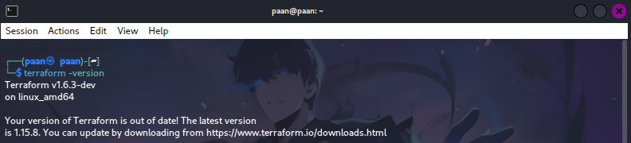
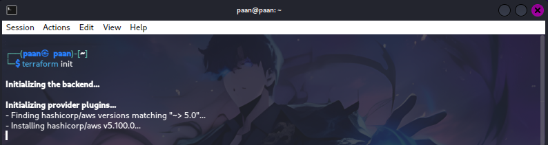
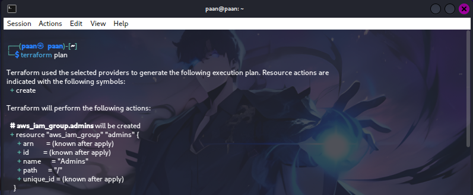
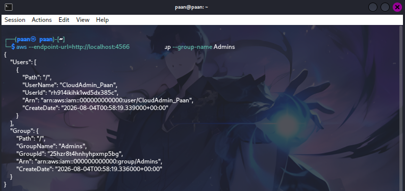
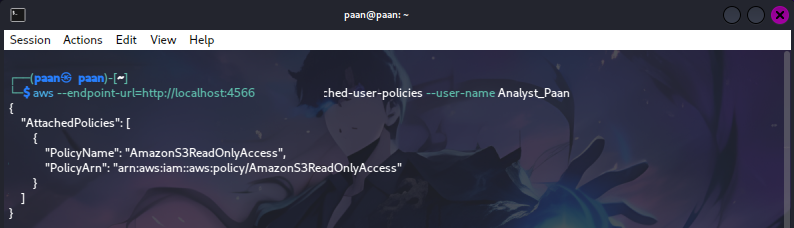

> Why this matters: Infrastructure as Code (IaC) makes identity resources version-controlled, repeatable, and reviewable. Changes to permissions can be peer-reviewed via pull requests before deployment, reducing the risk of accidental over-permissioning.

### Cleanup

```bash
terraform destroy -auto-approve
```

### 2. Policy Conditions with MFA Enforcement

A custom IAM policy can be written to deny all actions unless the request includes multi-factor authentication (MFA). This demonstrates how IAM policies support contextual conditions beyond simple action/resource matching.

### Custom Policy JSON `mfa-enforce.json`

```json
{
  "Version": "2012-10-17",
  "Statement": [
    {
      "Sid": "DenyAllUnlessMFA",
      "Effect": "Deny",
      "Action": "*",
      "Resource": "*",
      "Condition": {
        "BoolIfExists": {
          "aws:MultiFactorAuthPresent": "false"
        }
      }
    }
  ]
}
```

### Commands

```bash
# Create the policy in LocalStack
aws --endpoint-url=http://localhost:4566 iam create-policy     --policy-name EnforceMFA     --policy-document file://mfa-enforce.json

# Create a test user to attach the policy to
aws --endpoint-url=http://localhost:4566 iam create-user     --user-name SecureUser

# Attach the MFA-enforced policy
aws --endpoint-url=http://localhost:4566 iam attach-user-policy     --user-name SecureUser     --policy-arn arn:aws:iam::000000000000:policy/EnforceMFA

# Verify the policy attachment
aws --endpoint-url=http://localhost:4566 iam list-attached-user-policies     --user-name SecureUser
```

### Evidence
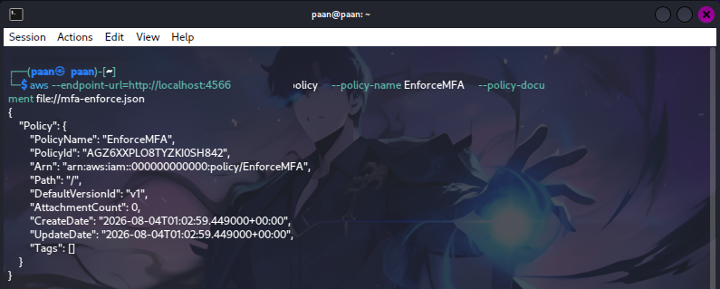
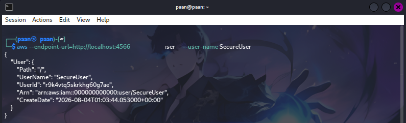
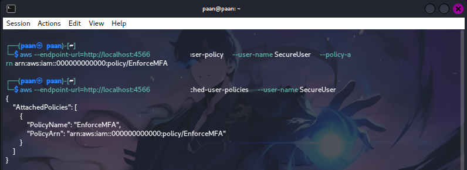

### Expected Behaviour:

- In real AWS, any API call made by SecureUser without a valid MFA session token would be denied.
- The BoolIfExists condition operator ensures the deny applies even if the aws:MultiFactorAuthPresent key is missing from the request context.
- This is commonly used to protect sensitive actions (like deleting resources or accessing billing information) behind an MFA gate.

> Note: LocalStack may not fully enforce all IAM condition keys, but the policy creation and attachment mechanics are identical to real AWS.

### 3. RBAC Depth: ClusterRole vs Role

A Role is scoped to a single namespace, whereas a ClusterRole is cluster-wide. This extension creates a ClusterRole and ClusterRoleBinding to compare their behaviour with the namespaced Role used in the main lab.

### Commands

```bash 
# Create a ClusterRole that can list pods across ALL namespaces
kubectl create clusterrole cluster-pod-reader     --verb=get,list,watch --resource=pods

# Create a service account in the prod namespace
kubectl create serviceaccount prod-viewer -n prod

# Bind the ClusterRole to the prod-viewer service account (cluster-wide scope)
kubectl create clusterrolebinding prod-viewer-binding     --clusterrole=cluster-pod-reader     --serviceaccount=prod:prod-viewer

# Verify the binding
kubectl get clusterrolebinding prod-viewer-binding -o yaml
```

### Comparison Test

```bash
# Set the service account variable
SA_PROD=system:serviceaccount:prod:prod-viewer

# Test 1: Can prod-viewer list pods in prod? (Should be YES)
kubectl auth can-i list pods -n prod --as=$SA_PROD

# Test 2: Can prod-viewer list pods in dev? (Should be YES — cluster-wide)
kubectl auth can-i list pods -n dev --as=$SA_PROD

# Test 3: Can the original dev-user list pods in prod? (Should be NO — namespaced)
SA_DEV=system:serviceaccount:dev:dev-user
kubectl auth can-i list pods -n prod --as=$SA_DEV
```

| Resource                             | Scope            | Use Case                                                               |
| ------------------------------------ | ---------------- | ---------------------------------------------------------------------- |
| `Role` + `RoleBinding`               | Single namespace | Per-team or per-environment access (e.g., dev team only sees dev pods) |
| `ClusterRole` + `ClusterRoleBinding` | Entire cluster   | Platform-wide access (e.g., monitoring tools, cluster admins)          |


### Evidence

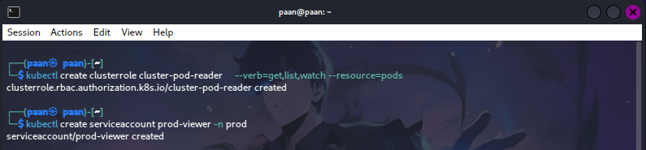
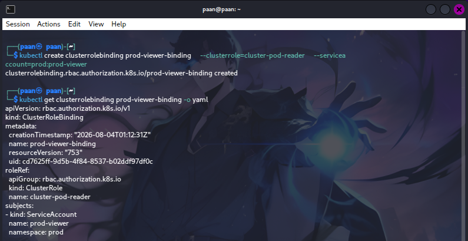
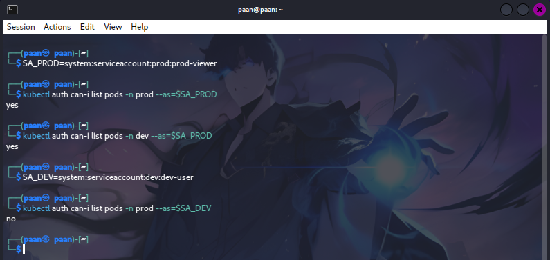

> Key Takeaway: Using a namespaced Role for the developer in the main lab was the correct least-privilege choice. A ClusterRole would have been over-permissioned because the developer does not need visibility into production or other teams' namespaces.

### Cleanup

```bash
kubectl delete clusterrolebinding prod-viewer-binding
kubectl delete clusterrole cluster-pod-reader
kubectl delete serviceaccount prod-viewer -n prod
```

### 4. Policy-as-Code Guardrails with OPA Gatekeeper

OPA (Open Policy Agent) Gatekeeper is an admission controller for Kubernetes that enforces policies before resources are created. This extension installs Gatekeeper and writes a policy that blocks any pod from running as the root user (runAsNonRoot: false or missing).

### Step 4.1: Install Gatekeeper

```bash 
# Install Gatekeeper v3.14.0
kubectl apply -f https://raw.githubusercontent.com/open-policy-agent/gatekeeper/v3.14.0/deploy/gatekeeper.yaml

# Wait for the pods to be ready
kubectl wait --for=condition=ready pod -l control-plane=controller-manager -n gatekeeper-system --timeout=120s
```

### Step 4.2: Define the Constraint Template
Create a file named `k8srequirednonroot-template.yaml`:

```yaml
apiVersion: templates.gatekeeper.sh/v1
kind: ConstraintTemplate
metadata:
  name: k8srequirednonroot
spec:
  crd:
    spec:
      names:
        kind: K8sRequiredNonRoot
  targets:
    - target: admission.k8s.gatekeeper.sh
      rego: |
        package k8srequirednonroot

        violation[{"msg": msg}] {
          container := input.review.object.spec.containers[_]
          not container.securityContext.runAsNonRoot
          msg := "Container must set securityContext.runAsNonRoot to true"
        }

        violation[{"msg": msg}] {
          container := input.review.object.spec.containers[_]
          container.securityContext.runAsNonRoot == false
          msg := "Container must not run as root (runAsNonRoot must be true)"
        }
```

Apply it:

```bash
kubectl apply -f k8srequirednonroot-template.yaml
```

### Step 4.3: Define the Constraint
Create a file named `require-nonroot-constraint.yaml`:

```yaml
apiVersion: constraints.gatekeeper.sh/v1beta1
kind: K8sRequiredNonRoot
metadata:
  name: require-nonroot
spec:
  match:
    kinds:
      - apiGroups: [""]
        kinds: ["Pod"]
    namespaces: ["dev"]
```

Apply it:

```bash
kubectl apply -f require-nonroot-constraint.yaml
```

### Step 4.4: Test the Policy
Create a file named `bad-pod.yaml` that violates the policy:

```yaml
apiVersion: v1
kind: Pod
metadata:
  name: bad-root-pod
  namespace: dev
spec:
  containers:
    - name: nginx
      image: nginx:latest
      # Missing securityContext.runAsNonRoot — this should be blocked
```

Try to apply it:

```bash
kubectl apply -f bad-pod.yaml
```

### Expected Result:

```bash
Error from server (Forbidden): error when creating "bad-pod.yaml": admission webhook "validation.gatekeeper.sh" denied the request: [require-nonroot] Container must set securityContext.runAsNonRoot to true
```

Now create a compliant pod `good-pod.yaml`:

```yaml
apiVersion: v1
kind: Pod
metadata:
  name: good-nonroot-pod
  namespace: dev
spec:
  securityContext:
    runAsNonRoot: true
  containers:
    - name: nginx
      image: nginx:alpine
      securityContext:
        runAsNonRoot: true
        allowPrivilegeEscalation: false
```

```bash
kubectl apply -f good-pod.yaml
```

Expected Result: The pod is created successfully.

### Step 4.5: Verify

```bash 
kubectl get pods -n dev
kubectl get constraints
kubectl describe constraint require-nonroot
```

### Evidence
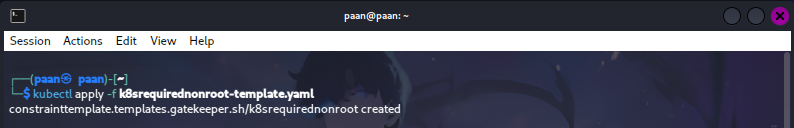
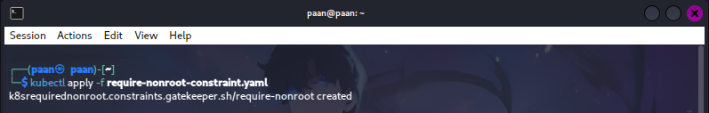
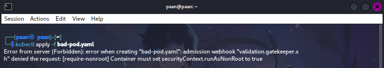
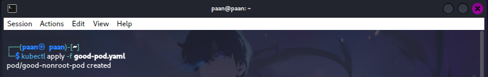
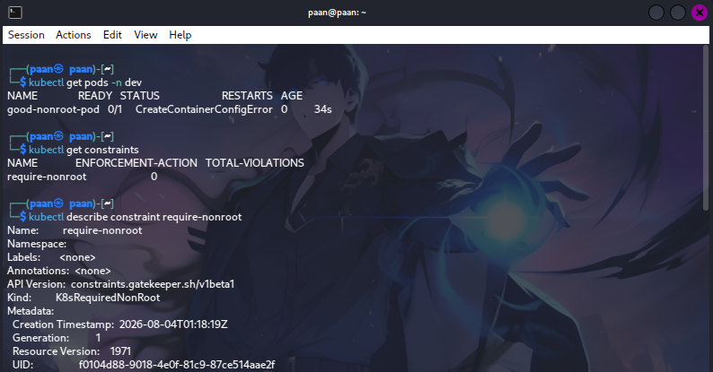

> Why this matters: Policy-as-Code shifts security left by preventing insecure configurations from reaching the cluster. Instead of relying on manual reviews, Gatekeeper automatically rejects pods that violate organisational security standards—such as running as root—before they are scheduled.

### Cleanup

```bash 
kubectl delete -f good-pod.yaml
kubectl delete -f require-nonroot-constraint.yaml
kubectl delete -f k8srequirednonroot-template.yaml
kubectl delete -f https://raw.githubusercontent.com/open-policy-agent/gatekeeper/v3.14.0/deploy/gatekeeper.yaml
```


### Summary of Advanced Concepts

| Extension             | Concept Demonstrated               | Security Benefit                                    |
| --------------------- | ---------------------------------- | --------------------------------------------------- |
| Terraform IaC         | Repeatable, version-controlled IAM | Auditability and reduced human error                |
| MFA Policy Conditions | Context-aware access control       | Protects sensitive actions even if credentials leak |
| ClusterRole vs Role   | Scope of RBAC permissions          | Prevents over-permissioning via namespace isolation |
| OPA Gatekeeper        | Admission control / Policy-as-Code | Blocks insecure workloads before deployment         |


---

## Conclusion
Lab 1 was completed successfully. LocalStack IAM demonstrated how cloud identities, groups, policies, and access keys can be managed securely using least-privilege principles. The Kubernetes section showed how RBAC enforces authorization based on identity, namespace, and assigned permissions. Overall, the lab proved that strong identity and access control practices are essential for protecting cloud resources and reducing security risk.
