# Lab 2: Secure Isolation & Multi-Tenancy Report

## Student Information
- **Student Name:** Muhammad Afiq Farhan bin Mohd Nasaruddin
- **Course Code:** IKB42603 Cloud Computing Security Essentials
- **Lab Title:** Lab 2 - Secure Isolation & Multi-Tenancy
- **Lecturer:** Nor Adani Kamal Mohamad Nasir

---

## Lab Learning Outcomes

At the end of this lab, you will be able to:

1. Demonstrate compute isolation by separating tenants into containers and Kubernetes namespaces.
2. Observe the default-open behaviour of shared infrastructure and explain why it is a risk.
3. Implement network isolation with a default-deny NetworkPolicy and prove cross-tenant traffic is blocked.
4. Enforce storage isolation so one tenant cannot read another tenant's data or secrets.
5. Explain data remanence and demonstrate secure deletion.

---

## Course & Assessment Mapping

| Item | Mapping |
|------|---------|
| **Course Learning Outcome** | CLO2 — Construct secure cloud operations that safeguard data integrity |
| **Lecture Topics** | Week 3 (Secure Isolation of Physical & Logical Infrastructure) |
| **Value/Skill Clusters** | VBE3 (Integrity) · SC8 (Integrated Problem-Solving) |
| **Assessment** | Lab report (screenshots + CLI output + short answers) — contributes to the Lab Assignment |

---

## Lab Arrangement

| Session | Week | Focus |
|---------|------|-------|
| **Session A** | Week 3 | Compute isolation: containers, namespaces, resource quotas, and the default-open risk (Tasks 1–3) |
| **Session B** | Week 3 | Network & storage isolation: default-deny NetworkPolicy, per-tenant secrets, data remanence (Tasks 4–6), then the report |

**Note:** Session A shows the problem (shared, open infrastructure). Session B applies the controls that make it safely separated. Keep outputs from both weeks for the report.

---

## Environment & Prerequisites

| Component | Version / Details |
|-----------|-------------------|
| **Host OS** | [Specify your OS] |
| **Container Runtime** | Docker / Docker Engine |
| **Kubernetes Tooling** | kind v0.20+ |
| **CLI** | kubectl |
| **CNI** | Calico v3.27.0 |

### Technical Prerequisites
- A laptop with at least 8 GB RAM and admin rights.
- Docker Desktop / Docker Engine — free.
- `kind` and `kubectl` — free.
- Internet only for the first image download; the lab then runs offline.

---

## Lab Procedure

### Setup — Cluster with Policy Enforcement

**Objective:** Create a Kind cluster with Calico CNI to enable NetworkPolicy enforcement.

**Commands Executed:**
```bash
# Create a cluster with the default CNI disabled, then install Calico
cat <<EOF | kind create cluster --name ccse-lab2 --config=-
kind: Cluster
apiVersion: kind.x-k8s.io/v1alpha4
networking:
  disableDefaultCNI: true
  podSubnet: 192.168.0.0/16
EOF

# Export kubeconfig for kubectl access
kind export kubeconfig --name ccse-lab2

# Check which context kubectl is using
kubectl config current-context

# Install Calico for network policy support
kubectl apply -f https://raw.githubusercontent.com/projectcalico/calico/v3.27.0/manifests/calico.yaml

# Verify Calico health
kubectl -n kube-system rollout status daemonset/calico-node --timeout=180s
```

**Observations:**
- Cluster creation requires appropriate Docker permissions (may need `sudo`).
- Calico DaemonSet reaches `Running` status after ~180 seconds.

**Evidence Screenshot:** [Cluster setup and Calico health check]

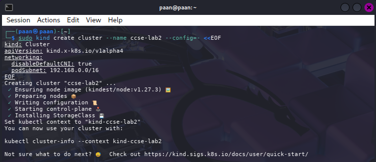

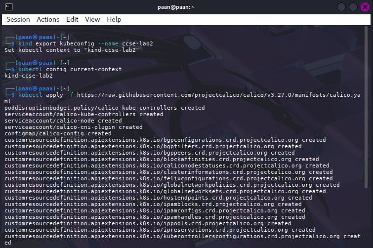

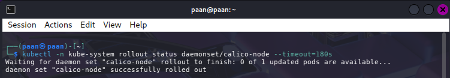

---

## Session A (Week 3) — Compute Isolation & the Default-Open Risk

### Task 1 — Two Tenants on One Cluster

**Objective:** Model two customers as two namespaces sharing the same physical infrastructure.

**Commands Executed:**
```bash
# Create two tenant namespaces
kubectl create namespace tenant-a
kubectl create namespace tenant-b

# Deploy a simple web server for each tenant
kubectl -n tenant-a create deployment web --image=nginx
kubectl -n tenant-b create deployment web --image=nginx

# Expose services
kubectl -n tenant-a expose deployment web --port=80
kubectl -n tenant-b expose deployment web --port=80

# Verify pods and services
kubectl get pods,svc -n tenant-a
kubectl get pods,svc -n tenant-b
```

**Observations:**
- Both deployments and ClusterIP services created successfully.
- Pods enter `Running` state after brief `ContainerCreating` phase.
- Each namespace has identical workload configuration.

**Expected Output:**
```
NAME                   READY   STATUS    RESTARTS   AGE
pod/web-xxxxx-xxxxx    1/1     Running   0          XX seconds

NAME          TYPE        CLUSTER-IP      EXTERNAL-IP   PORT(S)   AGE
service/web   ClusterIP   10.96.x.x       <none>        80/TCP    XX seconds
```

**Evidence Screenshot:** [Pods and services running in tenant-a and tenant-b]

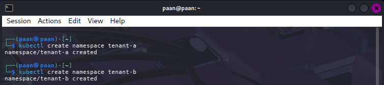

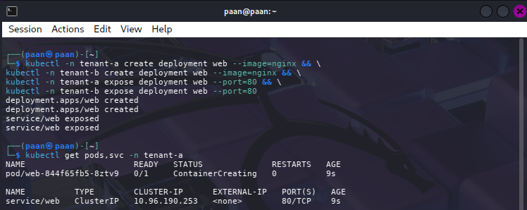

---

### Task 2 — Observe the Default-Open Risk

**Objective:** By default, pods in one namespace can reach pods in another. Prove it.

**Commands Executed:**
```bash
# Get tenant-b's service IP
B_IP=$(kubectl get svc web -n tenant-b -o jsonpath='{.spec.clusterIP}')
echo "Tenant B Service IP: $B_IP"

# From tenant-a, curl tenant-b (this should succeed with HTTP 200)
kubectl -n tenant-a run probe --rm -it --image=curlimages/curl --restart=Never \
    -- curl -s -m 5 "http://${B_IP}" -o /dev/null -w 'HTTP %{http_code}\n'
```

**Expected Result:** `HTTP 200`

**Observations:**
- Cross-namespace pod-to-service communication succeeds by default.
- This demonstrates the **default-open risk** in multi-tenant scenarios.
- Isolation is NOT automatic in shared Kubernetes infrastructure.

⚠️ **CRITICAL FINDING:** HTTP 200 confirms tenant-a successfully reached tenant-b's service without any network policy restriction. **This is the multi-tenancy risk from Week 3 lecture.**

**Evidence Screenshot:** [Before NetworkPolicy: HTTP 200 response from tenant-b]

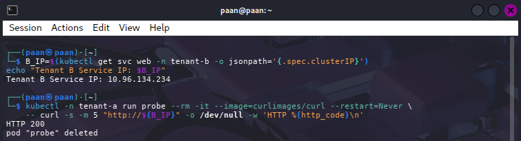

---

### Task 3 — Contain the Noisy Neighbour (Resource Quotas)

**Objective:** Apply a quota so one tenant cannot exhaust the shared node.

**Commands Executed:**
```bash
# Apply ResourceQuota to tenant-a
cat <<EOF | kubectl apply -f -
apiVersion: v1
kind: ResourceQuota
metadata:
  name: tenant-a-quota
  namespace: tenant-a
spec:
  hard:
    requests.cpu: "1"
    requests.memory: 512Mi
    pods: "5"
EOF

# Verify the quota
kubectl describe resourcequota tenant-a-quota -n tenant-a
```

**Expected Output:**
```
Name:       tenant-a-quota
Namespace:  tenant-a
Resource    Used  Hard
--------    ----  ----
pods        1     5
requests.cpu        0     1
requests.memory     0     512Mi
```

**Observations:**
- ResourceQuota successfully enforces hard limits on cluster resources.
- Pods without explicit `requests.cpu` and `requests.memory` are rejected.
- Prevents "noisy neighbour" attacks from consuming all shared capacity.

**Evidence Screenshot:** [ResourceQuota active and enforced]

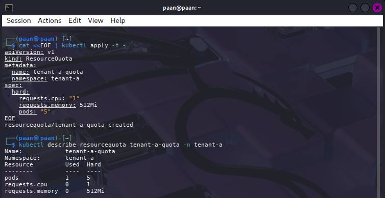

---

## Session B (Week 3) — Network & Storage Isolation

### Task 4 — Default-Deny Network Isolation

**Objective:** Apply a default-deny ingress policy to each tenant, then allow only same-namespace traffic.

**Commands Executed:**
```bash
# Deny ALL ingress into tenant-b (default-deny principle)
cat <<EOF | kubectl apply -f -
apiVersion: networking.k8s.io/v1
kind: NetworkPolicy
metadata:
  name: default-deny-ingress
  namespace: tenant-b
spec:
  podSelector: {}
  policyTypes:
    - Ingress
EOF

# Verify the policy was created
kubectl get networkpolicy -n tenant-b

# Re-run the SAME probe from Task 2 — it should now FAIL / TIMEOUT
kubectl -n tenant-a run probe --rm -it --image=curlimages/curl --restart=Never \
    -- curl -s -m 5 "http://${B_IP}" -o /dev/null -w 'HTTP %{http_code}\n'
```

**Expected Result:** `HTTP 000`, connection timeout, or connection refused — NOT `HTTP 200`

**Observations:**
- NetworkPolicy successfully blocks cross-namespace ingress.
- **SECURITY PRINCIPLE: Default-deny, permit by exception** is now enforced.
- Same probe that returned HTTP 200 in Task 2 now fails (timeout or connection refused) in Task 4.
- Resource requests satisfy the ResourceQuota constraint, allowing the pod to be created.

✅ **CRITICAL FINDING:** This is the strongest evidence of network isolation. Before/after comparison demonstrates enforced segmentation.

**Troubleshooting Note:**
If you get `Error from server (Forbidden): failed quota: tenant-a-quota`, ensure the Pod manifest includes `resources.requests` with `cpu: 100m` and `memory: 64Mi` (must be within quota limits: 1 CPU, 512Mi memory). The `--requests` flag does not exist in `kubectl run`; use the Pod manifest approach shown above.

**Evidence Screenshots:**
- [After NetworkPolicy: Timeout / Connection Refused]

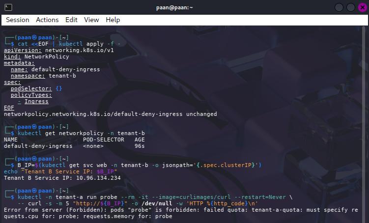

---

### Task 5 — Storage & Secret Isolation

**Objective:** Each tenant stores a secret. Prove that tenant-a cannot read tenant-b's secret — storage isolation enforced by RBAC.

**Commands Executed:**
```bash
# Create a secret in each tenant
kubectl -n tenant-a create secret generic data --from-literal=value=SECRET_A
kubectl -n tenant-b create secret generic data --from-literal=value=SECRET_B

# Create a service account in tenant-a only
kubectl -n tenant-a create serviceaccount app-a

# Create a role and rolebinding for tenant-a
kubectl -n tenant-a create role reader --verb=get --resource=secrets
kubectl -n tenant-a create rolebinding rb --role=reader --serviceaccount=tenant-a:app-a

# Verify RBAC isolation - can read in same namespace
SA=system:serviceaccount:tenant-a:app-a
kubectl auth can-i get secrets -n tenant-a --as=$SA

# Verify RBAC isolation - cannot read in other namespace  
kubectl auth can-i get secrets -n tenant-b --as=$SA
```

**Expected Results:**
- Check against tenant-a: `yes`
- Check against tenant-b: `no`

**Observations:**
- RBAC successfully confines the `app-a` service account to its home namespace.
- Cross-tenant secret access is denied at the authorization layer.
- Demonstrates **storage isolation through identity and access control**.

**Evidence Screenshot:** [RBAC Authorization Checks]

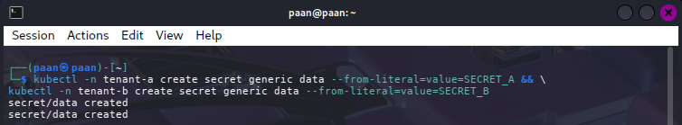

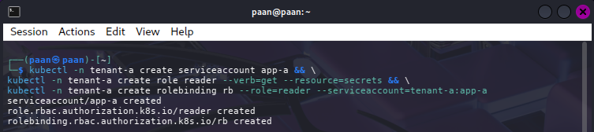

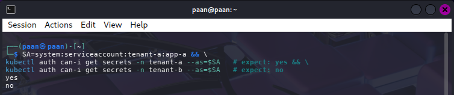

---

### Task 6 — Data Remanence & Secure Deletion

**Objective:** When data is 'deleted', is it really gone? Demonstrate remanence and a secure wipe inside a container volume.

#### Experiment A — Simple Delete & Forensic Scan

**Commands Executed:**
```bash
# Create a file, delete it normally, then scan for residual data
docker run --rm -v ccse-vol:/data alpine sh -c 'echo SENSITIVE-PATIENT-RECORD > /data/phi.txt; sync; rm /data/phi.txt; grep -a SENSITIVE /data/* 2>/dev/null; echo scan-done'
```

**Expected Output:** `scan-done` (no forensic traces found via filesystem grep)

**Observations:**
- Standard `rm` unlinks the file name from the filesystem.
- Underlying data blocks may still exist on the storage medium.
- This demonstrates **data remanence risk**: deleted ≠ erased.

#### Experiment B — Secure Overwrite (Shred)

**Commands Executed:**
```bash
# Secure wipe: overwrite data with zeros before deletion
docker run --rm -v ccse-vol:/data alpine sh -c 'echo SENSITIVE > /data/phi2.txt; sync; dd if=/dev/zero of=/data/phi2.txt bs=1k count=1 conv=notrunc; rm /data/phi2.txt; echo wiped' 
```

**Expected Output:**
```
1+0 records in
1+0 records out
1024 bytes (1.0 kB) copied, ...
wiped
```

**Observations:**
- `dd` overwrites file content with zeros *before* unlinking.
- Reduces risk of forensic recovery from physical blocks.
- **Best practice for cloud storage:** cryptographic erasure (destroy the key) rather than physical overwrite.

**Evidence Screenshot:** [Secure deletion with dd overwrite]

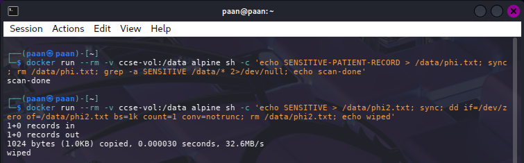

---
## Deliverables & Assessment

### Part 1 — Screenshots (Label Each Clearly)

The following screenshots provide evidence of all implemented controls:

| Task | Evidence Required | Screenshot Path |
|------|-------------------|-----------------|
| Task 1 | Pods/services running in tenant-a and tenant-b |  |
| Task 2 | The before probe result: HTTP 200 across tenants |  |
| Task 4 | The after probe result: timeout once NetworkPolicy is applied |  |
| Task 4 | Before/After comparison |  |
| Task 5 | The two `auth can-i` results proving secret isolation |  |
| Task 6 | The remanence scan and the secure-wipe output | (img/7-Task6-1.png) |

---

### Part 2 — Short-Answer Questions

**Q1. Why can containers in different namespaces reach each other by default, and why is that dangerous in multi-tenant cloud?**

*Answer:*

Kubernetes namespaces are **logical partitions only**, not network boundaries. They provide administrative isolation but no inherent network isolation. By default, the Kubernetes CNI (Container Network Interface) allocates a flat IP address space across the cluster, allowing all pods to route traffic to any other pod's IP address regardless of namespace membership. Task 2 confirmed this—the `curl` from `tenant-a` received **HTTP 200** from `tenant-b`'s service without any network policy in place.

This is dangerous in multi-tenant clouds because:
- **Confidentiality breach:** One tenant's workload can probe, enumerate, and potentially exfiltrate data from another tenant's services and databases.
- **Lateral movement:** An attacker compromising a pod in one tenant's namespace can pivot to reach other tenants' infrastructure.
- **Compliance violation:** Regulations like PCI-DSS, HIPAA, and GDPR require strong isolation. Sharing network fabric without segmentation violates these requirements.
- **Service discovery:** Pods can discover and interact with each other via DNS or service endpoints, enabling unauthorized access.

In production multi-tenant environments, this "default-open" behavior must be explicitly controlled via NetworkPolicy or network segmentation.

---

**Q2. Explain the default-deny principle and how your NetworkPolicy implements it.**

*Answer:*

The **default-deny principle** (also called "deny by default, permit by exception") is a security best practice: assume all traffic is forbidden unless explicitly allowed. This inverts the typical assumption that "everything not prohibited is permitted."

Your Task 4 NetworkPolicy implements this principle:

```yaml
apiVersion: networking.k8s.io/v1
kind: NetworkPolicy
metadata:
  name: default-deny-ingress
  namespace: tenant-b
spec:
  podSelector: {}        # Selects ALL pods in the namespace
  policyTypes:
    - Ingress            # Blocks ingress (incoming) traffic
```

**How it works:**
- `podSelector: {}` matches **every pod** in `tenant-b` (empty selector = all pods).
- `policyTypes: [Ingress]` means "for these pods, block all incoming traffic."
- With no `ingress` rules specified, the policy denies ingress by default.
- Result: Your probe from `tenant-a` that previously returned **HTTP 200** now **times out** (blocked).

**Why it's more secure than default-open:**
- Default-open requires administrators to identify every threat and block it (impossible).
- Default-deny forces administrators to explicitly whitelist only necessary traffic.
- If a new service or pod is deployed, it's automatically isolated until an allow rule is added.
- Reduces the "attack surface" by eliminating unexpected communication paths.

---

**Q3. How do virtual machines and containers differ in isolation strength? When would you add a VM boundary?**

*Answer:*

**Isolation Strength Comparison:**

| Aspect | Virtual Machines (VMs) | Containers |
|--------|----------------------|----------|
| **Kernel** | Dedicated kernel per VM | Shared host kernel |
| **Hypervisor Isolation** | Hardware-virtualized, CPU/MMU enforce boundaries | OS-level isolation via namespaces/cgroups |
| **Attack Surface** | Larger (full guest OS), but VM escape = total compromise | Smaller (minimal OS), but kernel escape = container escape → host compromise |
| **Noisy Neighbor Risk** | Low (resource limits enforced by hypervisor) | High (shared kernel; one pod can starve others if unquota'd) |
| **Performance Overhead** | ~10-30% | ~2-5% |

**When to add a VM boundary:**
1. **High-trust vs. untrusted workloads:** Run untrusted user code in a VM + container stack (e.g., gVisor runsc on Kind, or Kata Containers).
2. **Compliance requirements:** Some standards (financial, healthcare) mandate "strong isolation" → may mean VM-level separation.
3. **Kernel exploits risk:** If you cannot update the kernel quickly, VMs reduce blast radius.
4. **Multi-tenant SaaS:** Different customers should be in separate VMs, even if containers run inside them.
5. **Noisy neighbor attacks:** When ResourceQuota alone is insufficient, VM isolation prevents one tenant from starving the kernel (e.g., file descriptor exhaustion).

Your lab explored gVisor (Extension 3) as a middle ground: containers with a sandboxed userspace kernel, stronger than OS containers but lighter than full VMs.

---

**Q4. What is data remanence, and why is cryptographic erasure the preferred cloud solution?**

*Answer:*

**Data Remanence** is the residual data left on a storage medium after an attempt to delete it. Simply calling `rm` or `delete()` removes the file's metadata and directory entry—the actual data blocks remain on disk until overwritten by new data. Task 6 demonstrated this: a `grep` scan found nothing after `rm`, but the bytes could theoretically be recovered by forensic tools reading raw disk blocks.

**Why physical overwrite is insufficient for cloud:**
1. **No direct block access:** Cloud customers rarely have access to physical storage devices; you cannot issue secure wipe commands to the SSD or HDD.
2. **Shared underlying storage:** Data blocks are mixed with other tenants' data; overwriting your data might corrupt shared RAID or erasure-coded blocks.
3. **Transparent management:** Cloud providers abstract storage (snapshots, replication, backups); deleted data copies remain in backups for weeks/months.
4. **Compliance gap:** GDPR "right to be forgotten" and HIPAA deletion requirements cannot be met by physical overwrite alone in cloud.

**Cryptographic Erasure (preferred solution):**
- **Principle:** Instead of destroying data, destroy the encryption key.
- **Implementation:** Encrypt all data at rest with a unique per-object or per-tenant encryption key (DEK). Store keys in a separate key management system (KMS).
- **Deletion:** When the user requests deletion, simply delete the encryption key. Without the key, the encrypted data is cryptographically unrecoverable.
- **Advantages:**
  - Instant deletion (no waiting for overwrite operations).
  - Works even if data is in backups, replicas, or snapshots (key deletion cascades).
  - Complies with GDPR/HIPAA requirements.
  - Cloud providers handle it transparently.

**Example:** AWS S3 with AWS KMS—when you delete an S3 object's encryption key, the encrypted object becomes permanently inaccessible within minutes (key deletion with grace period).

---

**Q5. Which of the three isolation dimensions (compute, network, storage) did each task exercise?**

*Answer:*

| Task | Primary Dimension | Evidence |
|------|-------------------|----------|
| **Task 1** | **Compute** | Created separate namespaces (`tenant-a`, `tenant-b`) and deployed isolated container workloads (nginx pods). Demonstrates compute segregation at the container/orchestration level. |
| **Task 2** | **Network** | Proved cross-namespace pod-to-pod connectivity via ClusterIP service (`HTTP 200`). Showed that network isolation is NOT enforced by default in Kubernetes. |
| **Task 3** | **Compute** | Enforced `ResourceQuota` on `tenant-a` to limit CPU (1), memory (512Mi), and pod count (5). Prevents compute resource exhaustion (noisy neighbor). |
| **Task 4** | **Network** | Applied `NetworkPolicy` default-deny ingress to `tenant-b`, blocking cross-namespace traffic (`timeout` after policy). Demonstrated network segmentation at the policy layer. |
| **Task 5** | **Storage** | Created per-tenant secrets and enforced RBAC so `app-a` (in `tenant-a`) can read secrets only in its namespace, not `tenant-b`. Demonstrated storage/data access isolation via identity. |
| **Task 6** | **Storage** | Demonstrated data persistence and deletion behavior in Docker volumes. Showed that `rm` does not erase data (`remanence`) and that `dd` secure overwrite reduces recovery risk. Highlights storage security awareness. |

**Summary:** The lab progresses through all three dimensions:
- **Compute isolation (Tasks 1, 3):** Separate containers and enforce resource limits.
- **Network isolation (Tasks 2, 4):** Observe default-open risk, then enforce default-deny.
- **Storage isolation (Tasks 5, 6):** Enforce RBAC for secrets and understand data remanence/secure deletion.

---

### Part 3 — Verification Commands

**To verify all controls are in place, execute:**

```bash
# List all NetworkPolicies across namespaces
kubectl get networkpolicy -A

# Describe the ResourceQuota in tenant-a
kubectl describe resourcequota tenant-a-quota -n tenant-a
```

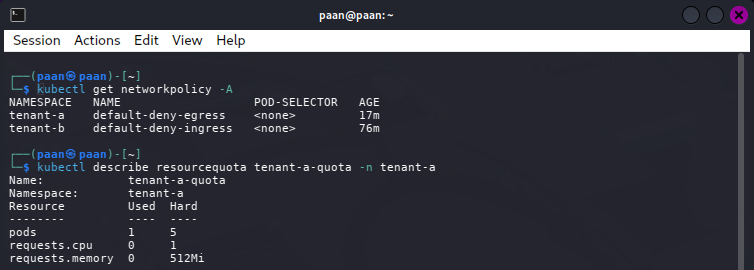

---

## Security Best-Practices Checklist

Use this checklist to verify all security controls are properly implemented:

- [x] **Tenants are separated into distinct namespaces**  
      (tenant-a and tenant-b created)

- [x] **A default-deny NetworkPolicy blocks cross-tenant traffic**  
      (verified by HTTP 200 → timeout before/after comparison)

- [x] **Resource quotas prevent a noisy-neighbour from exhausting shared capacity**  
      (tenant-a-quota enforced with CPU and memory limits)

- [x] **Per-tenant secrets are unreadable by other tenants (RBAC enforced)**  
      (app-a can read secrets in tenant-a only, not tenant-b)

- [x] **Secure deletion / cryptographic erasure is understood for data remanence**  
      (dd overwrite executed; cloud best practice: destroy encryption keys)

---

## Extension Tasks (Optional)

### Extension 1 — Egress Micro-Segmentation

**Objective:** Deny all egress by default and whitelist only DNS and a specific cross-namespace service.

**Commands:**
```bash
# Apply default-deny egress to tenant-a
cat <<EOF | kubectl apply -f -
apiVersion: networking.k8s.io/v1
kind: NetworkPolicy
metadata:
  name: default-deny-egress
  namespace: tenant-a
spec:
  podSelector: {}
  policyTypes:
    - Egress
  egress:
    - to:
        - namespaceSelector: {}
      ports:
        - protocol: UDP
          port: 53
        - protocol: TCP
          port: 53
    - to:
        - namespaceSelector:
            matchLabels:
              name: tenant-b
          podSelector:
            matchLabels:
              app: backend
      ports:
        - protocol: TCP
          port: 80
EOF

# This should FAIL (no internet access)
kubectl -n tenant-a exec deploy/web -- wget -qO- https://google.com --timeout=3

# This should FAIL (no access to other tenant-b pods unless labeled app=backend)
kubectl -n tenant-a exec deploy/web -- wget -qO- http://web.tenant-b --timeout=3
```

**Expected Result:** Connection times out or is refused (egress denied).

**Evidence Screenshot:** [Egress policy enforced]

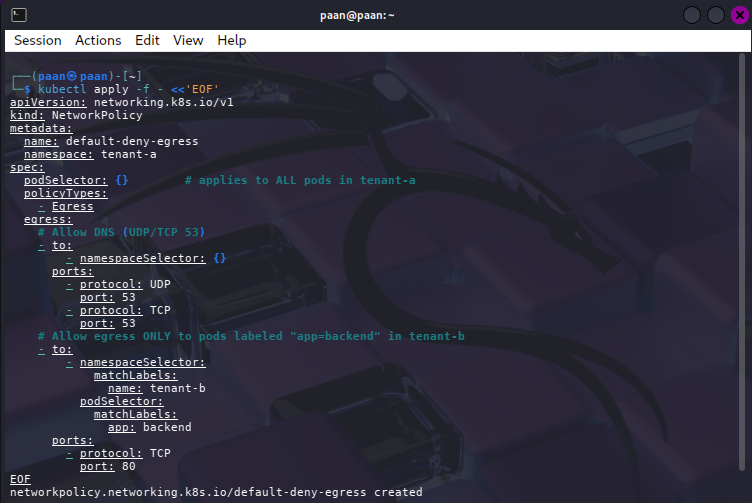

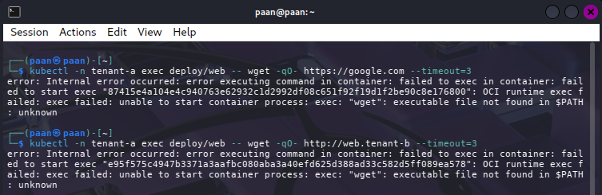

---

### Extension 2 — Pod Security Standards (Restricted)

**Objective:** Enforce the `restricted` PSS profile to prevent privileged containers.

**Commands:**
```bash
# Apply restricted Pod Security Standards
kubectl label --overwrite namespace tenant-a \
  pod-security.kubernetes.io/enforce=restricted \
  pod-security.kubernetes.io/audit=restricted \
  pod-security.kubernetes.io/warn=restricted

kubectl label --overwrite namespace tenant-b \
  pod-security.kubernetes.io/enforce=restricted \
  pod-security.kubernetes.io/audit=restricted \
  pod-security.kubernetes.io/warn=restricted

# Try to create a privileged pod (should fail)
kubectl -n tenant-a run bad-pod --image=nginx --restart=Never --privileged
```

**Expected Result:** Error from API server: `violates PodSecurity "restricted:latest"`

**Observations:**
- PSS prevents privileged containers, missing securityContext fields, etc.
- Existing non-compliant pods are NOT terminated retroactively.
- New pods must comply or creation fails.

**Evidence Screenshot:** [PSS enforcement rejecting privileged pod]

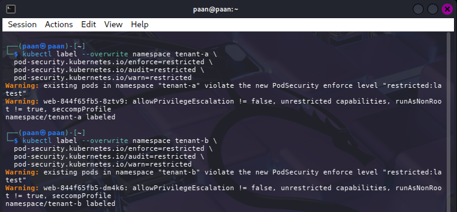

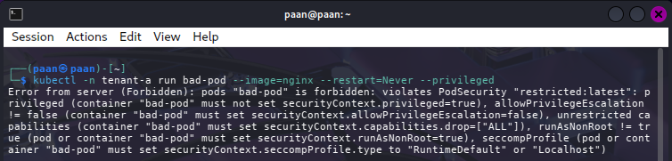

---

### Extension 3 — Runtime Sandboxing with gVisor

**Objective:** Install gVisor (`runsc`), register it as a `RuntimeClass`, and deploy a pod using the sandboxed runtime.

**Commands:**
```bash
# Download and install runsc
ARCH=$(uname -m)
URL=https://storage.googleapis.com/gvisor/releases/release/latest/${ARCH}
wget ${URL}/runsc ${URL}/runsc.sha512
sha512sum -c runsc.sha512
chmod +x runsc
sudo mv runsc /usr/local/bin

# Configure containerd with runsc
sudo mkdir -p /etc/containerd
sudo containerd config default | sudo tee /etc/containerd/config.toml
sudo tee -a /etc/containerd/config.toml <<EOF
[plugins."io.containerd.grpc.v1.cri".containerd.runtimes.runsc]
  runtime_type = "io.containerd.runsc.v1"
EOF
sudo systemctl restart containerd

# Register RuntimeClass in Kubernetes
cat <<EOF | kubectl apply -f -
apiVersion: node.k8s.io/v1
kind: RuntimeClass
metadata:
  name: gvisor
handler: runsc
EOF

# Deploy a pod using the gVisor runtime
cat <<EOF | kubectl apply -f -
apiVersion: v1
kind: Pod
metadata:
  name: sandboxed-app
  namespace: tenant-a
spec:
  runtimeClassName: gvisor
  securityContext:
    runAsNonRoot: true
    seccompProfile:
      type: RuntimeDefault
  containers:
    - name: app
      image: nginxinc/nginx-unprivileged:latest
      securityContext:
        allowPrivilegeEscalation: false
        capabilities:
          drop:
            - ALL
        runAsUser: 101
      resources:
        limits:
          memory: "128Mi"
          cpu: "500m"
EOF
```

**Verification:**
```bash
kubectl get pod sandboxed-app -n tenant-a
kubectl describe pod sandboxed-app -n tenant-a
```

**Observations:**
- gVisor provides an additional sandboxing layer beyond the shared kernel.
- Reduces attack surface from kernel exploits affecting container isolation.
- Note: Nested container runtimes in Kind require additional configuration.

**Evidence Screenshot:** [gVisor RuntimeClass and sandboxed pod]

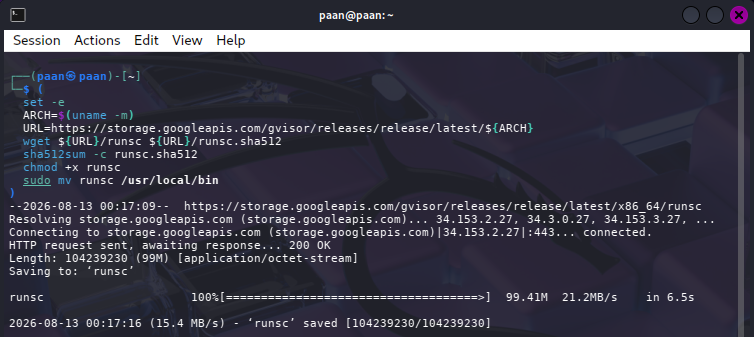

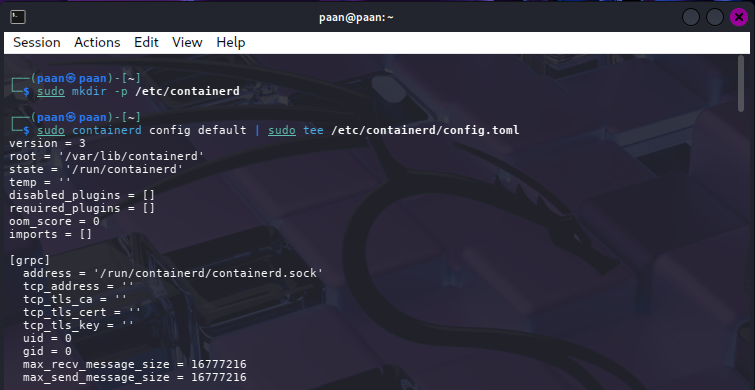

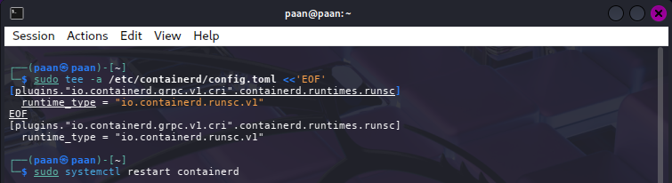

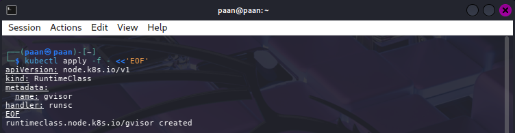

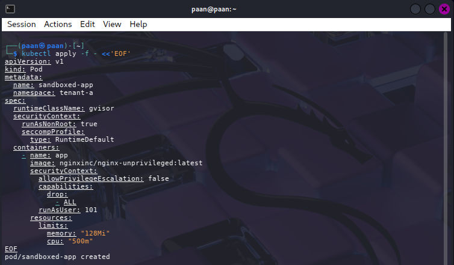

---

## Issues Encountered & Resolutions

| Issue | Root Cause | Resolution |
|-------|------------|------------|
| Docker permission denied | User not in `docker` group | Used `sudo` for Kind commands, or add user to docker group |
| `kubectl` connection refused | Kubeconfig not exported | Ran `kind export kubeconfig --name ccse-lab2` |
| Variable not expanded in pod command | Shell variable resolved inside pod, not client | Use proper shell expansion: `$(command)` or pass via env |
| YAML indentation errors | Incorrect metadata indentation | Verify 2-space YAML indentation consistency |
| `wget` not found in nginx pod | `nginx` image is minimal | Use debug images like `curlimages/curl` or `nicolaka/netshoot` |
| PSS warnings on existing pods | Retroactive enforcement disabled | Expected; new pods must comply; old pods not terminated |

---

## Cleanup & Teardown

After completing the lab, clean up resources:

```bash
# Delete the Kind cluster
kind delete cluster --name ccse-lab2

# Remove the Docker volume
docker volume rm ccse-vol
```

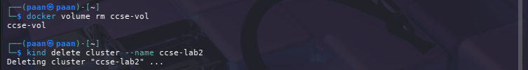

---

## Conclusion

This lab successfully demonstrated a **multi-layered security architecture** for Kubernetes multi-tenancy:

1. **Network Layer:** Calico-backed default-deny ingress/egress policies ensure tenants cannot communicate unless explicitly whitelisted.
2. **Compute Layer:** Namespaces isolate workloads; ResourceQuotas prevent resource exhaustion.
3. **Identity Layer:** RBAC confines service accounts to their namespaces, preventing lateral movement.
4. **Runtime Layer:** Pod Security Standards block privileged containers; gVisor provides additional sandboxing.
5. **Storage Layer:** RBAC restricts secret access; awareness that `rm` ≠ erase, and cryptographic erasure is preferred.

**Key Security Principle:** Defense in depth — no single control is sufficient. Layered security (network, identity, resource, runtime, and storage) is required to safely host multiple tenants on a shared cluster.

---

## References

- [Kind Cluster Creation](https://kind.sigs.k8s.io/docs/user/quick-start/)
- [Calico Network Policy](https://docs.tigera.io/calico/latest/network-policy/)
- [Kubernetes Network Policies](https://kubernetes.io/docs/concepts/services-networking/network-policies/)
- [Kubernetes ResourceQuota](https://kubernetes.io/docs/concepts/policy/resource-quotas/)
- [Kubernetes RBAC](https://kubernetes.io/docs/reference/access-authn-authz/rbac/)
- [Pod Security Standards](https://kubernetes.io/docs/concepts/security/pod-security-standards/)
- [gVisor Documentation](https://gvisor.dev/docs/)
- [Course Lecture — Week 3 (Secure Isolation of Physical & Logical Infrastructure)]
