# Lab 3: Data Protection, Encryption and Key Management

## Student Information
- **Student Name:** Muhammad Afiq Farhan bin Mohd Nasaruddin
- **Course Code:** IKB42603 Cloud Computing Security Essentials
- **Lab Title:** Lab 2 - Secure Isolation & Multi-Tenancy
- **Lecturer:** Nor Adani Kamal Mohamad Nasir

---

**Topic:** At-rest encryption, in-transit encryption, envelope encryption and cryptographic erasure  
**Tools:** OpenSSL, Docker/Nginx, AWS CLI and LocalStack KMS

---

## Lab Learning Outcomes

At the end of this lab, I was able to:

1. Encrypt and decrypt data using symmetric AES and asymmetric RSA cryptography.
2. Protect data in transit with TLS and explain why HTTPS prevents plaintext interception.
3. Use a KMS and implement envelope encryption.
4. Apply per-tenant keys and demonstrate cryptographic erasure.
5. Verify data integrity with hashing and construct a tamper-evident hash chain.

## Course and Assessment Mapping

| Item | Mapping |
|------|---------|
| **Course Learning Outcome** | CLO2 - Construct secure cloud operations that safeguard data integrity |
| **Lecture Topics** | Week 4 (Data Protection) and Week 9 (Key Management Patterns) |
| **Value/Skill Clusters** | VBE3 (Integrity) and SC8 (Integrated Problem-Solving) |
| **Assessment** | Lab report with screenshots, CLI output and short answers |

## Lab Arrangement

| Session | Week | Focus |
|---------|------|-------|
| **Session A** | Week 4 | Symmetric/asymmetric encryption and TLS (Tasks 1-3) |
| **Session B** | Week 4 | KMS, envelope encryption, tenant keys, erasure and integrity (Tasks 4-7) |

**Note:** Session A established the cryptographic fundamentals. Session B showed how key management controls the lifecycle and recoverability of protected cloud data.

---

## Introduction

This laboratory demonstrated how confidentiality, integrity and key management work together in a cloud environment. The work covered symmetric AES encryption, asymmetric RSA encryption, digital signatures, TLS, AWS KMS operations through LocalStack, envelope encryption, per-tenant keys, cryptographic erasure and hash-chained records.

The practical work used a sample confidential patient record. The record was encrypted and decrypted locally, served through HTTPS, protected using KMS-managed keys, and tested for integrity and tampering. The screenshots in this report provide the supporting evidence captured during the exercises.

## Environment and Preparation

The commands were executed from the lab directory using a Bash-compatible terminal, Docker and LocalStack. The KMS endpoint used for Session B was:

```bash
EP='--endpoint-url=http://localhost:4566'
```

The test data was created as follows:

```bash
echo 'Patient: Ahmad, Diagnosis: confidential' > record.txt
```

The text represents sensitive data that should be protected while stored and transmitted.

## Task 1: Symmetric Encryption with AES

### Procedure

The record was encrypted using AES-256-CBC with PBKDF2 key derivation and a random salt:

```bash
openssl enc -aes-256-cbc -pbkdf2 -salt \
	-in record.txt -out record.enc
```

The encrypted file was displayed with `cat record.enc`; its contents were not readable as the original patient record. It was then decrypted with the same passphrase:

```bash
openssl enc -d -aes-256-cbc -pbkdf2 \
	-in record.enc -out record.dec.txt
diff record.txt record.dec.txt && echo 'MATCH: decryption successful'
```

### Result and observation

The `MATCH: decryption successful` message confirmed that the decrypted file matched the original. AES is efficient for protecting data at rest, but the same secret key is needed for both encryption and decryption. The key must therefore be shared securely with every authorised user or service. If it is intercepted, unauthorised users can decrypt the data.

### Evidence

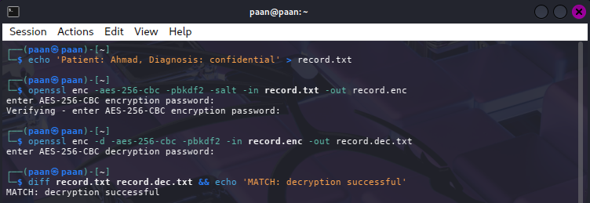

## Task 2: RSA Encryption and Digital Signatures

### Procedure

An RSA 2048-bit private key and its corresponding public key were generated:

```bash
openssl genrsa -out private.pem 2048
openssl rsa -in private.pem -pubout -out public.pem
```

The public key encrypted the record and the private key decrypted it:

```bash
openssl pkeyutl -encrypt -pubin -inkey public.pem \
	-in record.txt -out record.rsa
openssl pkeyutl -decrypt -inkey private.pem \
	-in record.rsa -out record.rsa.txt
```

The record was signed using the private key and verified using the public key:

```bash
openssl dgst -sha256 -sign private.pem -out record.sig record.txt
openssl dgst -sha256 -verify public.pem \
	-signature record.sig record.txt
```

### Result and observation

RSA solved the key-distribution problem differently from AES: the public key can be distributed openly while the private key remains secret. Successful signature verification showed that the record had not changed and that it was signed by the holder of the private key. RSA is useful for authentication, signatures and key exchange, but it is slower than AES and is not normally used to encrypt large files directly.

### Evidence

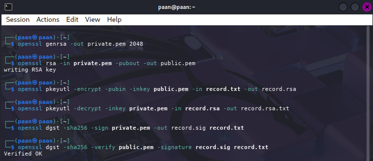

## Task 3: Encryption in Transit with TLS

### Procedure

A short-lived self-signed certificate and private key were created for `localhost`:

```bash
openssl req -x509 -newkey rsa:2048 \
	-keyout key.pem -out cert.pem -days 7 -nodes \
	-subj '/CN=localhost'
```

The following Nginx configuration enabled HTTPS and served the record from the default web root:

```bash
cat > nginx.conf <<'EOF'
server {
	listen 443 ssl;
	server_name _;

	ssl_certificate /etc/nginx/cert.pem;
	ssl_certificate_key /etc/nginx/key.pem;

	root /usr/share/nginx/html;
}
EOF
```

Nginx was configured to listen on HTTPS port 443 inside a Docker container. The certificate, private key, configuration and record were mounted into the container, with host port 8443 mapped to container port 443:

```bash
docker run --rm -d --name tls -p 8443:443 \
	-v "$(pwd)/cert.pem:/etc/nginx/cert.pem:ro" \
	-v "$(pwd)/key.pem:/etc/nginx/key.pem:ro" \
	-v "$(pwd)/nginx.conf:/etc/nginx/conf.d/default.conf:ro" \
	-v "$(pwd)/record.txt:/usr/share/nginx/html/record.txt:ro" \
	nginx
curl -k https://localhost:8443/record.txt
```

The `-k` option was required because the certificate was self-signed and was not issued by a trusted public certificate authority.

### Result and observation

The `curl` request returned the record through an HTTPS connection. TLS encrypts traffic between the client and server, preventing an on-path attacker from reading the record in transit. Without TLS, a plain HTTP request would expose the record as clear text. In production, the self-signed certificate would be replaced with a certificate issued by a trusted CA.

### Evidence

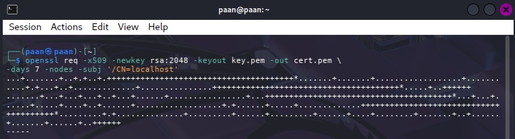

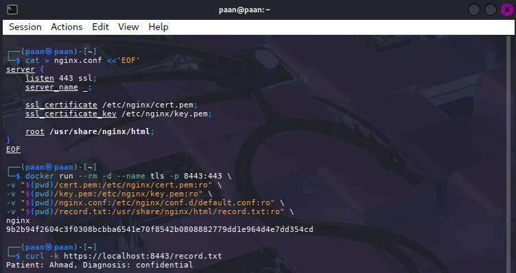

## Task 4: Create and Use a KMS Master Key

### Procedure

LocalStack KMS was used to create a customer master key for tenant A:

```bash
aws $EP kms create-key --description 'CCSE tenant-A master key'
KEY_A=<KEY_ID>
```

The KMS key encrypted the small plaintext value `hello`:

```bash
aws $EP kms encrypt --key-id $KEY_A \
	--plaintext "$(echo -n 'hello' | base64)" \
	--query CiphertextBlob --output text
```

### Result and observation

KMS returned a ciphertext blob rather than the original plaintext. The master key was referenced by its key ID, so the application did not need to handle the master key material directly. This illustrates how a KMS centralises key access and supports controlled use of encryption keys.

### Evidence

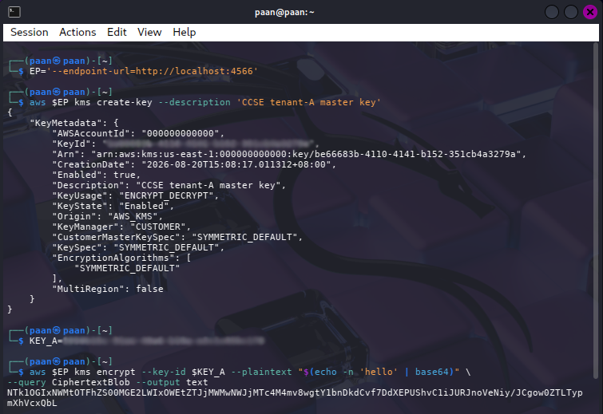

## Task 5: Envelope Encryption

### Procedure

A 256-bit data key was generated by KMS. The command returned both the plaintext data key and its KMS-encrypted, or wrapped, version:

```bash
aws $EP kms generate-data-key --key-id "$KEY_A" \
	--key-spec AES_256 --query '[Plaintext,CiphertextBlob]' \
	--output text > datakeys.txt
awk '{print $1}' datakeys.txt > datakey.b64
awk '{print $2}' datakeys.txt > datakey.enc
base64 -d datakey.b64 > datakey.bin
wc -c datakey.bin
```

The plaintext data key encrypted the record locally:

```bash
openssl enc -aes-256-cbc -pbkdf2 -in record.txt \
	-out record.env.enc -pass file:./datakey.bin
```

After encryption, the plaintext data key was deleted:

```bash
rm datakey.bin datakey.b64
echo 'Only the KMS-wrapped data key (datakey.enc) remains.'
```

### Result and observation

The record was encrypted locally with the data key, while `datakey.enc` retained the data key in wrapped form under tenant A's KMS master key. This is envelope encryption. It is efficient for large data because bulk encryption uses fast symmetric cryptography, while KMS protects only the small data key. The plaintext data key was removed from disk after use, reducing exposure.

### Evidence

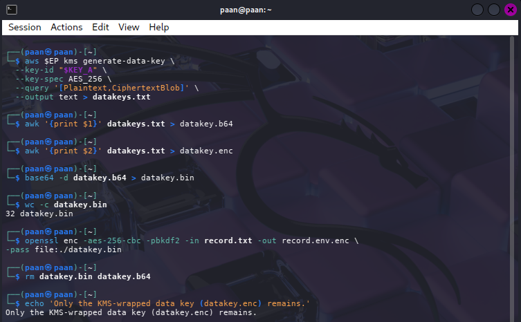

## Task 6: Per-Tenant Keys and Cryptographic Erasure

### Procedure

A separate master key was created for tenant B:

```bash
aws $EP kms create-key --description 'CCSE tenant-B master key'
KEY_B=<KEY_ID>
```

Tenant A's key was scheduled for deletion and disabled immediately to simulate erasure:

```bash
aws $EP kms schedule-key-deletion --key-id $KEY_A --pending-window-in-days 7
aws $EP kms disable-key --key-id "$KEY_A"
```

An attempt was made to unwrap tenant A's encrypted data key:

```bash
aws $EP kms decrypt --ciphertext-blob fileb://datakey.enc 2>&1 | head -3
```

### Result and observation

The decrypt operation failed after tenant A's key was disabled. This demonstrated that `datakey.enc` could no longer be unwrapped and the encrypted record could not be recovered through the normal KMS process. Tenant B's separate key provides isolation between tenants. In a real cloud KMS, deleting the wrapping key material makes the protected data unrecoverable; LocalStack models this behaviour by disabling and scheduling the key for deletion.

### Evidence

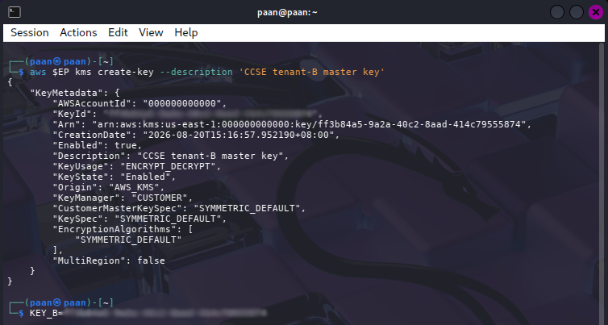

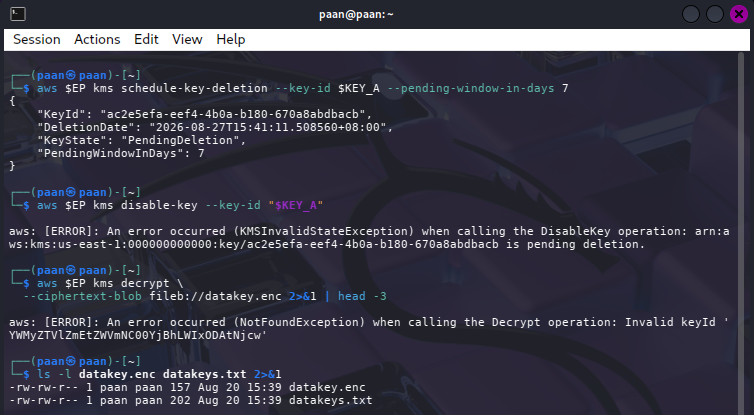

## Task 7: Integrity and Tamper-Evident Records

### Procedure

The original record was fingerprinted with SHA-256. A copy was modified and both files were hashed:

```bash
sha256sum record.txt
cp record.txt tampered.txt
echo 'x' >> tampered.txt
sha256sum record.txt tampered.txt
```

A simple hash chain was built, with each entry hashed together with the previous hash:

```bash
PREV=0
for line in 'login ok' 'file read' 'export data'; do
	PREV=$(echo -n "$PREV$line" | sha256sum | cut -d' ' -f1)
	echo "$line | $PREV"
done
```

### Result and observation

The original and modified files produced different SHA-256 values, showing that even a small change is detectable. In the hash chain, changing one earlier log entry changes its hash and every following hash. This makes the sequence tamper-evident: an auditor can recalculate the chain and identify that the record history no longer matches. Hashing does not provide confidentiality, so it complements rather than replaces encryption.

### Evidence

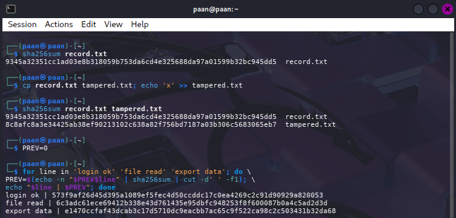

---

## Verification

The KMS key list and RSA signature were verified using the commands below:

```bash
aws --endpoint-url=http://localhost:4566 kms list-keys
openssl dgst -sha256 -verify public.pem \
	-signature record.sig record.txt
```

**Observations:**
- The KMS command confirmed that the LocalStack KMS keys existed.
- The OpenSSL command confirmed that the signature matched the original record.
- These checks provided a final verification of key availability and record integrity.

**Evidence Screenshot:** [KMS key listing and RSA signature verification]

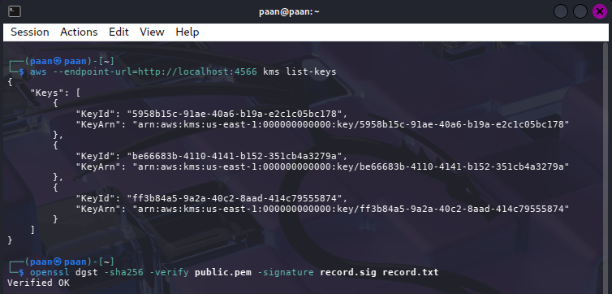

## Expansion Ideas

The following extensions were carried out to explore practical key-management and authentication patterns beyond the core lab tasks.

### Expansion 1 - Key Rotation and Re-encryption

**Objective:** Create a replacement master key and verify that new ciphertext can be encrypted and decrypted with it.

**Commands Executed:**

```bash
KEY_NEW=$(aws $EP kms create-key \
	--description 'CCSE rotated master key' \
	--query 'KeyMetadata.KeyId' --output text)

aws $EP kms encrypt --key-id "$KEY_NEW" \
	--plaintext "$(echo -n 'rotation-test' | base64)" \
	--query CiphertextBlob --output text | base64 -d > rotated-test.enc

aws $EP kms decrypt --ciphertext-blob fileb://rotated-test.enc \
	--query Plaintext --output text | base64 -d
```

**Observations:**
- A new KMS master key was created for the rotation test.
- The test value was encrypted with the replacement key and decrypted successfully.
- In production, existing wrapped data keys would also need to be re-wrapped or migrated in a controlled process.

**Evidence Screenshot:** [KMS key rotation test]

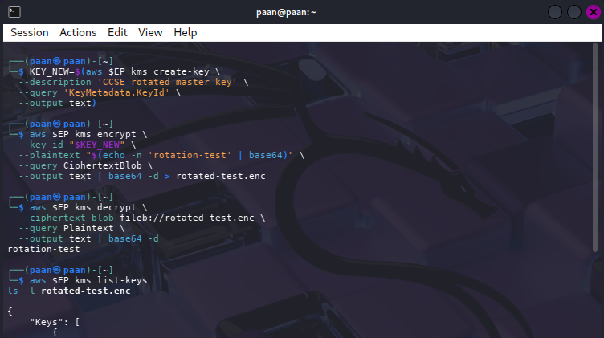

### Expansion 2 - Mutual TLS

**Objective:** Require both the server and client to authenticate using certificates signed by the same certificate authority.

A private certificate authority was created first. Server and client certificates were then generated and signed by the CA. The server certificate included `serverAuth`, while the client certificate included `clientAuth`:

```bash
openssl req -x509 -newkey rsa:2048 -nodes \
	-keyout ca.key -out ca.crt -days 365 \
	-subj "/CN=CCSE CA"

openssl req -newkey rsa:2048 -nodes \
	-keyout server.key -out server.csr \
	-subj "/CN=localhost"

openssl x509 -req -in server.csr -CA ca.crt -CAkey ca.key \
	-CAcreateserial -out server.crt -days 365 \
	-extfile <(printf "subjectAltName=DNS:localhost\nextendedKeyUsage=serverAuth")

openssl req -newkey rsa:2048 -nodes \
	-keyout client.key -out client.csr \
	-subj "/CN=client"

openssl x509 -req -in client.csr -CA ca.crt -CAkey ca.key \
	-CAcreateserial -out client.crt -days 365 \
	-extfile <(printf "extendedKeyUsage=clientAuth")
```

The previous TLS container was stopped before starting the mTLS server. Nginx was configured to trust the lab CA and require a client certificate:

```bash
docker rm -f tls 2>/dev/null

cat > nginx-mtls.conf <<'EOF'
server {
		listen 443 ssl;
		server_name localhost;

		ssl_certificate /etc/nginx/server.crt;
		ssl_certificate_key /etc/nginx/server.key;
		ssl_client_certificate /etc/nginx/ca.crt;
		ssl_verify_client on;

		root /usr/share/nginx/html;
}
EOF
```

The Nginx container was then started with the server certificate, server key, CA certificate, configuration and record mounted as read-only files:

```bash
docker run --rm -d --name mtls-server -p 8443:443 \
	-v "$(pwd)/nginx-mtls.conf:/etc/nginx/conf.d/default.conf:ro" \
	-v "$(pwd)/server.crt:/etc/nginx/server.crt:ro" \
	-v "$(pwd)/server.key:/etc/nginx/server.key:ro" \
	-v "$(pwd)/ca.crt:/etc/nginx/ca.crt:ro" \
	-v "$(pwd)/record.txt:/usr/share/nginx/html/record.txt:ro" \
	nginx
```

A request without a client certificate was tested first. A second request supplied the client certificate and private key:

```bash
curl -k https://localhost:8443/record.txt

curl -k --cacert ca.crt --cert client.crt --key client.key \
	https://localhost:8443/record.txt
```

**Observations:**
- The request without a client certificate was rejected because the client was not authenticated.
- The request with `client.crt` and `client.key` succeeded.
- mTLS extends normal TLS by authenticating both sides of a service connection.

**Evidence Screenshots:** [mTLS certificate setup and client authentication]

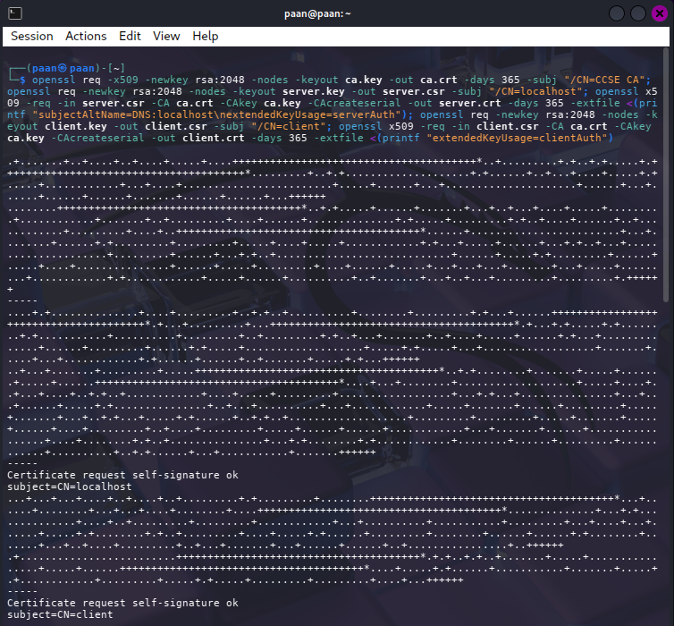

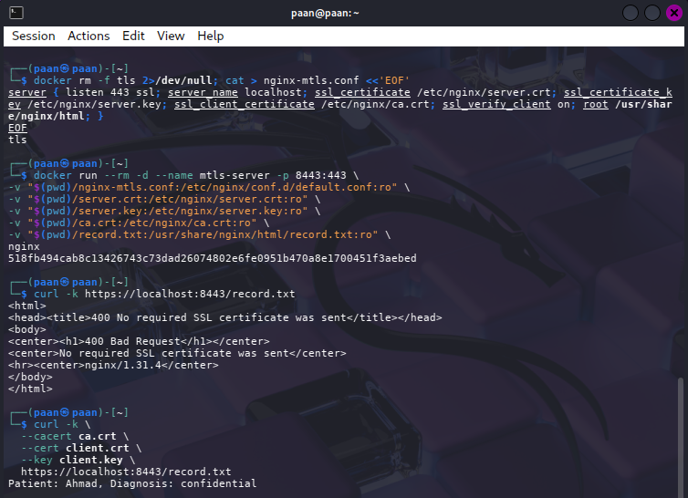

### Expansion 3 - HashiCorp Vault Transit Engine

**Objective:** Use Vault's Transit engine to perform encryption without exposing the master key to the application.

**Commands Executed:**

```bash
docker run -d --name vault -p 8200:8200 \
	-e VAULT_DEV_ROOT_TOKEN_ID=root \
	hashicorp/vault

export VAULT_ADDR='http://127.0.0.1:8200'
export VAULT_TOKEN=root

docker exec -e VAULT_ADDR='http://127.0.0.1:8200' -e VAULT_TOKEN=root \
	vault vault secrets enable transit

docker exec -e VAULT_ADDR='http://127.0.0.1:8200' -e VAULT_TOKEN=root \
	vault vault write -f transit/keys/ccse

docker exec -e VAULT_ADDR='http://127.0.0.1:8200' -e VAULT_TOKEN=root \
	vault vault list transit/keys

PLAINTEXT=$(base64 -w0 record.txt)

docker exec -e VAULT_ADDR='http://127.0.0.1:8200' -e VAULT_TOKEN=root \
	vault vault write transit/encrypt/ccse plaintext="$PLAINTEXT"

docker exec -e VAULT_ADDR='http://127.0.0.1:8200' -e VAULT_TOKEN=root \
	vault vault write -f transit/keys/ccse/rotate

docker exec -e VAULT_ADDR='http://127.0.0.1:8200' -e VAULT_TOKEN=root \
	vault vault read transit/keys/ccse
```

The Transit engine was enabled, the `ccse` key was created and listed, and the record was base64-encoded before being submitted for encryption. The key was then rotated and its metadata was read to verify the updated key state.

**Observations:**
- The Vault container started on port 8200 and was accessed through the development root token.
- The Transit secrets engine managed the `ccse` cryptographic key inside Vault.
- The application submitted plaintext to the Transit encryption endpoint instead of directly storing the master key.
- The key listing confirmed that the Transit key existed before encryption.
- The encryption command returned Vault-managed ciphertext for the record.
- Key rotation created a new key version while retaining the Transit key path.
- The final key read displayed the key metadata and current version information.

**Evidence Screenshots:** [Vault setup, encryption and key rotation]

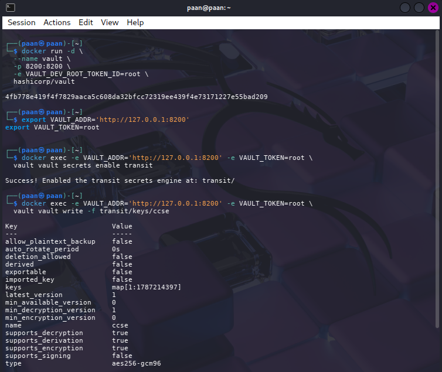

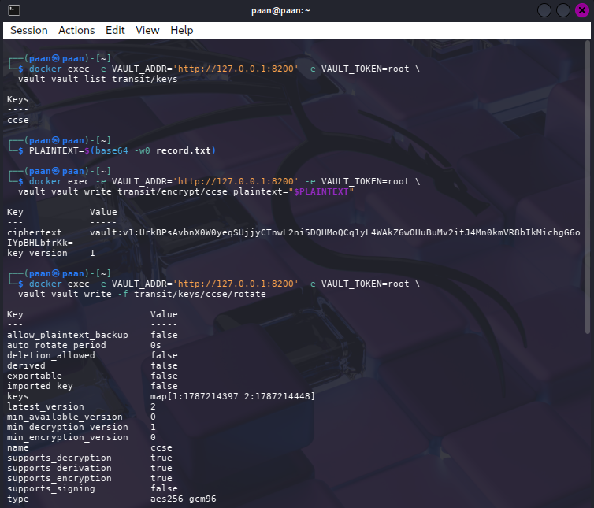

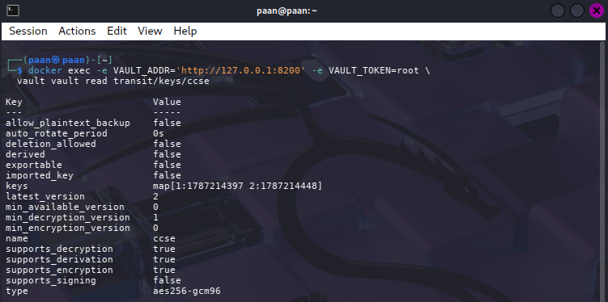

### Expansion 4 - SoftHSM and PKCS#11

**Objective:** Model hardware-backed key protection using a software HSM and the PKCS#11 interface.

SoftHSM2 and OpenSC were installed first. These packages provide a software implementation of an HSM and command-line tools for interacting with PKCS#11 objects:

```bash
sudo apt update
sudo apt install softhsm2 opensc
```

The available SoftHSM slots were checked before initializing a token:

```bash
softhsm2-util --show-slots
```

A token labelled `CCSE-LAB` was initialized in a free slot. The Security Officer PIN and user PIN were supplied during initialization:

```bash
softhsm2-util --init-token \
	--free \
	--label CCSE-LAB \
	--so-pin 1234 \
	--pin 5678
```

The slots were checked again to verify that the token had been created:

```bash
softhsm2-util --show-slots
```

An RSA 2048-bit key pair was generated inside the token through the SoftHSM PKCS#11 module. The private key was managed as a token object rather than created as an ordinary file in the working directory:

```bash
pkcs11-tool --module /usr/lib/softhsm/libsofthsm2.so \
	--login \
	--pin 5678 \
	--keypairgen \
	--key-type rsa:2048 \
	--label ccse-signing-key \
	--id 01
```

The token objects were listed to verify that the signing key pair existed:

```bash
pkcs11-tool --module /usr/lib/softhsm/libsofthsm2.so \
	--login \
	--pin 5678 \
	--list-objects
```

The final verification commands were then executed:

```bash
softhsm2-util --show-slots
pkcs11-tool --list-objects
```

**Observations:**
- `apt update` refreshed the package index and `apt install` installed SoftHSM2 and OpenSC.
- The first `softhsm2-util --show-slots` command displayed the available slots before token initialization.
- The `CCSE-LAB` token was initialized in a free slot with separate Security Officer and user PINs.
- The second slot check confirmed the initialized token and its slot information.
- The RSA 2048-bit signing key pair was generated through `/usr/lib/softhsm/libsofthsm2.so` and labelled `ccse-signing-key` with object ID `01`.
- `pkcs11-tool --list-objects` confirmed that the key objects were stored in the token.
- SoftHSM models the interface of an HSM for learning; production systems should use a properly protected hardware HSM and should never use example PINs such as `1234` or `5678`.

**Evidence Screenshots:** [SoftHSM token and PKCS#11 key operations]

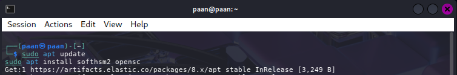

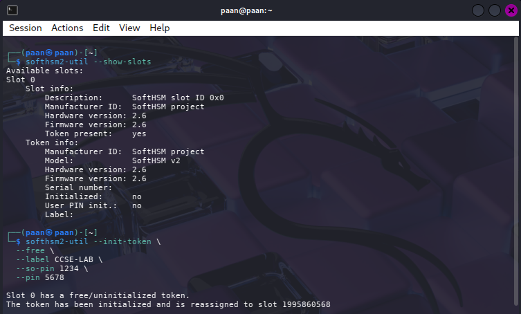

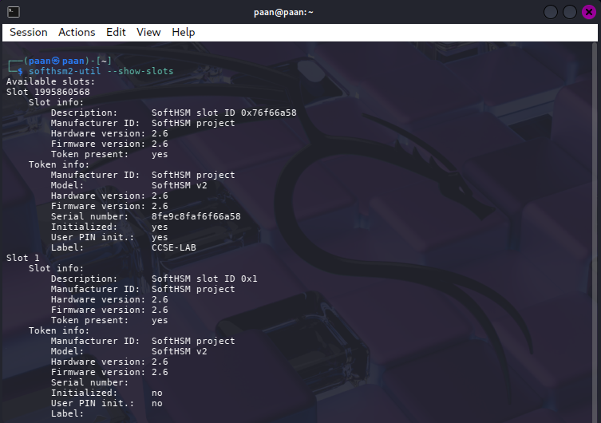

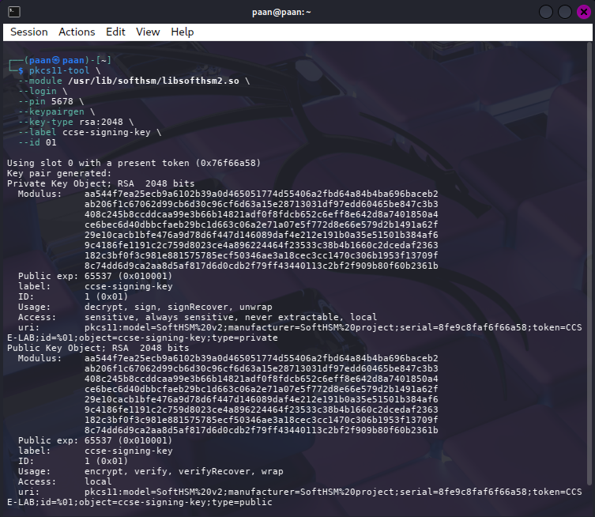

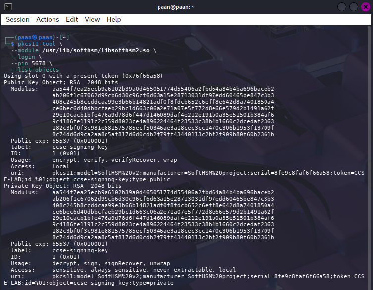

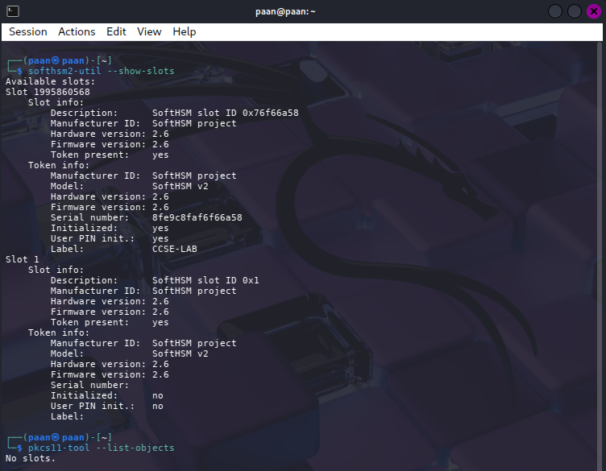

---

## Short-Answer Questions

### Q1. Compare symmetric and asymmetric encryption: speed, key distribution and typical use.

Symmetric encryption uses one shared secret key for encryption and decryption. It is fast and efficient for large files, database records and network payloads. Its main weakness is key distribution because the secret must reach every authorised party without being exposed. AES is an example.

Asymmetric encryption uses a related public/private key pair. The public key can be distributed openly while the private key remains secret. It is slower and is normally used for authentication, digital signatures and secure key exchange rather than large files. RSA is an example. TLS combines both methods: asymmetric cryptography establishes trust or exchanges a session key, then symmetric cryptography protects the actual data.

### Q2. Why is key management described as the weakest link, not the algorithm?

Strong algorithms such as AES and RSA are publicly studied and can be secure when configured correctly. However, an algorithm cannot protect data if its key is weak, exposed, reused improperly, stored in source code or given to the wrong identity. Key management includes key generation, storage, access control, rotation, auditing, backup, revocation and deletion. Cloud systems involve many users, services and tenants, so an operational key-management failure can defeat otherwise strong cryptography.

### Q3. Explain envelope encryption and why only the master key needs hardware-grade protection.

Envelope encryption uses two levels of keys. A data key encrypts the actual file locally using a fast symmetric algorithm. A KMS master key encrypts, or wraps, the data key. The encrypted data and wrapped data key can be stored together, but the plaintext data key is removed after use.

The master key does not process the whole file; it protects only the small data key. Hardware-grade protection and strict access controls can therefore be concentrated around the master key in the KMS. The application can encrypt large files efficiently without directly managing the master key. If the master key is unavailable, the wrapped data key cannot be recovered and the file cannot be decrypted.

### Q4. How does cryptographic erasure achieve provable deletion where overwriting cannot in the cloud?

Cryptographic erasure deletes or permanently disables the key required to decrypt the data. In this lab, tenant A's KMS key was disabled and scheduled for deletion, causing the attempt to unwrap `datakey.enc` to fail. Without the wrapping key, the encrypted data key and encrypted record are computationally unusable.

Overwriting is difficult to prove in cloud storage because data can be replicated, backed up, cached or moved across storage that the customer cannot access directly. Destroying the encryption key avoids locating and overwriting every physical copy. This provides a stronger, auditable deletion claim, provided that no usable copy of the key exists elsewhere and the KMS deletion process is enforced correctly.

### Q5. How does a hash chain make a log tamper-evident?

A hash chain calculates each record hash from the current log entry and the previous hash. If an attacker changes or removes an earlier entry, its hash changes and the next record's expected previous hash no longer matches. The mismatch propagates through the remaining entries and reveals tampering.

The chain is tamper-evident rather than automatically tamper-proof: it detects unauthorised changes when checked, but does not itself stop an attacker from editing the log. A production design should also protect the chain anchor, restrict write access, timestamp entries, use append-only storage and add signatures or an external trusted checkpoint.

---

## Deliverables and Assessment Evidence

| Task | Evidence captured |
|------|-------------------|
| Task 1 | AES ciphertext and `MATCH: decryption successful` |
| Task 2 | RSA encryption/decryption and signature verification |
| Task 3 | HTTPS request through the Nginx TLS container |
| Tasks 4-5 | KMS key ID, direct KMS encryption and envelope-encryption files |
| Task 6 | Failed KMS decrypt after tenant A's key was disabled |
| Task 7 | Different SHA-256 values and the hash-chain output |
| Expansions | Key rotation, mTLS, Vault and SoftHSM evidence |

## Security Best-Practices Checklist

- [x] Data encrypted at rest with AES and decryption verified.
- [x] RSA used correctly: public key for encryption and private key for signing.
- [x] Data protected in transit with TLS.
- [x] Envelope encryption used; plaintext data key removed from disk.
- [x] Separate tenant keys created and cryptographic erasure demonstrated.
- [x] Integrity checked with SHA-256 and a hash chain.
- [x] KMS key listing and RSA signature verification completed.

## Cleanup and Teardown

The temporary TLS container and generated files can be removed after the evidence has been captured:

```bash
docker stop tls 2>/dev/null
rm -f record.* private.pem public.pem key.pem cert.pem datakey.* tampered.txt
docker stop localstack && docker rm localstack
```

Cleanup prevents test keys, plaintext data and temporary services from remaining on the system after the lab.

## Conclusion

This lab showed that protecting cloud data requires more than selecting an encryption algorithm. AES provided efficient confidentiality, RSA demonstrated public-key encryption and signatures, and TLS protected data in transit. LocalStack KMS added centralised key control, envelope encryption reduced plaintext-key exposure, per-tenant keys supported isolation and cryptographic erasure, and hash chains provided tamper evidence. Together, these controls form a layered approach to cloud data protection.

## References

- IKB42603 Cloud Computing Security Essentials, Lab 3 manual, UniKL MIIT.
- [OpenSSL Documentation](https://www.openssl.org/docs/)
- [AWS KMS Concepts](https://docs.aws.amazon.com/kms/)
- Cloud Security Alliance, *Security Guidance v5*, Data Security and Encryption.
