# Lab 5: Monitoring, Logging and Incident Detection

## Student Information
- **Student Name:** Muhammad Afiq Farhan bin Mohd Nasaruddin
- **Course Code:** IKB42603 Cloud Computing Security Essentials
- **Lab Title:** Lab 5 - Monitoring, Logging and Incident Detection
- **Lecturer:** Nor Adani Kamal Mohamad Nasir

---

**Topic:** Centralised logging, tamper-proof logs, threat detection, incident response, management-plane auditing, and backup/restore validation  
**Tools:** Docker, LocalStack, AWS CLI, grep, awk, sha256sum, iptables, bash, s3 sync

## Lab Learning Outcomes

At the end of this lab, I was able to:

1. Collect and centralise logs from multiple services.
2. Distinguish logs from events and query logs for security-relevant activity.
3. Build a tamper-evident, hash-chained log and detect alteration.
4. Detect an incident by correlating events such as brute-force login attempts followed by suspicious actions.
5. Execute incident-response steps: detect, contain, collect evidence, and document a timeline.
6. Reconstruct the management-plane audit trail to identify cloud changes made outside application traffic.
7. Measure backup and restore capability, and explain the relationship between RTO, RPO, and backup design.

## Course and Assessment Mapping

| Item | Mapping |
|------|---------|
| **Course Learning Outcome** | CLO2 - Construct secure cloud operations that safeguard data integrity |
| **Lecture Topics** | Week 6 (Monitoring, Auditing & Management), Week 2 (Security Design & Architecture), and resilience/backup concepts |
| **Value/Skill Clusters** | VBE3 (Integrity) and SC8 (Integrated Problem-Solving) |
| **Assessment** | Lab report + short incident report + evidence from management-plane audit and recovery drill |

## Lab Arrangement

| Session | Week | Focus |
|---------|------|-------|
| **Session A** | Week 9 | Generate and centralise logs; query failed logins (Tasks 1-3) |
| **Session B** | Week 10 | Hash-chained logs, incident detection, containment and evidence collection (Tasks 4-6) |
| **Addendum** | Homework / supervised review | Management-plane audit trail, backup design, and restore drill (Tasks A1-A4) |

**Note:** Session A builds visibility. Session B turns that visibility into detection and response. The addendum extends this into the cloud control plane, where changes to the cloud itself may leave no application log at all.

## Introduction

This laboratory demonstrated the importance of monitoring and logging in cloud systems. The first part focused on log generation and centralisation using LocalStack and AWS CloudWatch Logs, showing how security-relevant activity such as repeated failed logins can be detected and queried. The second part then moved into tamper-evidence and incident response, where a hash-chained log and event correlation were used to identify a likely brute-force attack followed by data export.

The addendum extended the exercise beyond the application layer and into the management plane. This is the part of the cloud that records administrative actions such as creating users, attaching policies, deleting buckets or modifying security controls. Those operations may never produce application traffic, so a separate audit trail, secure storage and tested restore process are critical to both security and resilience.

The evidence images in this report should be replaced with screenshots captured from the terminal after each task. Each placeholder identifies the exact output that should be visible.

## Environment and Preparation

The commands were run from a terminal with Docker and the AWS CLI configured to the LocalStack endpoint.

```bash
docker run -d --name localstack -p 4566:4566 localstack/localstack:3.0
EP='--endpoint-url=http://localhost:4566'
aws $EP logs create-log-group  --log-group-name /ccse/app
aws $EP logs create-log-stream --log-group-name /ccse/app --log-stream-name auth
```

A secure operational posture depends on visibility: if the team cannot see failed logins, privilege changes or data access, they cannot detect or prove what happened.

---

## Session A (Week 9) — Logging & Centralisation

### Setup — Start LocalStack

```bash
docker run -d --name localstack -p 4566:4566 localstack/localstack:3.0
EP='--endpoint-url=http://localhost:4566'
aws $EP logs create-log-group  --log-group-name /ccse/app
aws $EP logs create-log-stream --log-group-name /ccse/app --log-stream-name auth
```

### Task 1: Generate Application Logs

#### Procedure

Create a small log of authentication events, including failed access attempts and a suspicious export.

```bash
cat > auth.log <<'EOF'
2025-03-01T09:00:01 LOGIN_OK    user=ahmad   ip=10.0.0.5
2025-03-01T09:01:10 LOGIN_FAIL  user=admin   ip=203.0.113.9
2025-03-01T09:01:12 LOGIN_FAIL  user=admin   ip=203.0.113.9
2025-03-01T09:01:15 LOGIN_FAIL  user=admin   ip=203.0.113.9
2025-03-01T09:01:18 LOGIN_FAIL  user=admin   ip=203.0.113.9
2025-03-01T09:01:22 LOGIN_OK    user=admin   ip=203.0.113.9
2025-03-01T09:01:40 EXPORT_DATA user=admin   ip=203.0.113.9 size=500MB
EOF
cat auth.log
```

#### Result and observation

The log captured normal login activity as well as repeated failed attempts from the same IP address. This is the raw evidence that later proves a likely attack sequence.

#### Evidence

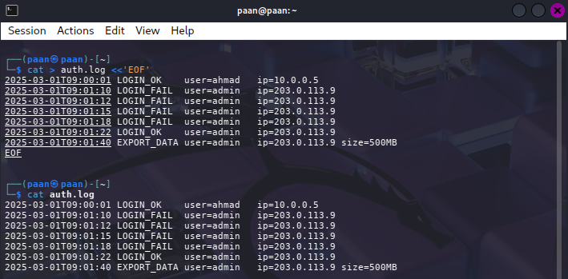

**Evidence placeholder:** Paste a screenshot of the generated `auth.log` contents showing `LOGIN_FAIL`, `LOGIN_OK`, and `EXPORT_DATA` lines.

### Task 2: Centralise Logs (Ship to CloudWatch)

#### Procedure

Each line was copied into the central log service using a timestamped event stream.

```bash
TS=$(date +%s000)
while IFS= read -r line; do
  aws $EP logs put-log-events --log-group-name /ccse/app --log-stream-name auth \
    --log-events timestamp=$TS,message="$line" >/dev/null; TS=$((TS+1000));
done < auth.log

aws $EP logs get-log-events --log-group-name /ccse/app --log-stream-name auth \
    --query 'events[].message' --output text
```

#### Result and observation

The read-back from the central store confirmed that the same log lines were now stored in a centralised, queryable service rather than remaining only on a host. This is the foundation of monitoring: logs become searchable evidence, not just local debug output.

#### Evidence

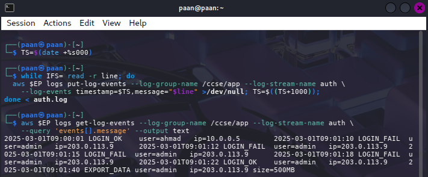

**Evidence placeholder:** Paste the `aws logs get-log-events` output showing the same login and export records returned from the central log service.

### Task 3: Query for Security-Relevant Activity

#### Procedure

The failed login count was grouped by source IP to identify suspicious activity.

```bash
grep LOGIN_FAIL auth.log | awk '{print $4, $5}' | sort | uniq -c
```

The task also distinguished logs from events:

```bash
# Distinguish a log (durable record) from an event (a trigger):
# an EVENT would be 'alert: 4 failures from 203.0.113.9' fired in near real time.
```

#### Result and observation

Repeated failed logins from IP `203.0.113.9` had already revealed a security-relevant pattern. A single log line might appear harmless, but when aggregated it becomes a relevant event and a suspicious source.

#### Evidence

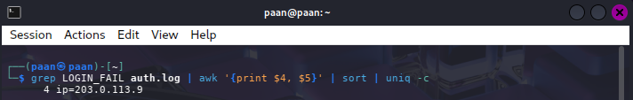

**Evidence placeholder:** Paste a screenshot showing the grouped `LOGIN_FAIL` counts and the IP responsible for repeated failed attempts.

---

## Session B (Week 10) — Tamper-Proofing, Detection & Response

### Task 4: Tamper-Proof (Hash-Chained) Logs

#### Procedure

A hash chain was created so that each log line depends on the previous one. A modification to any earlier line would change the final digest.

```bash
PREV=0
while IFS= read -r line; do
  PREV=$(printf '%s%s' "$PREV" "$line" | sha256sum | cut -d' ' -f1)
  printf '%s | %s\n' "$line" "$PREV"
done < auth.log > auth.chain
cat auth.chain

sed 's/500MB/5MB/' auth.log > auth.tampered
PREV=0; BROKE=no
Recompute the chain from auth.tampered and compare the final hash to auth.chain.
```

#### Result and observation

The hash chain demonstrated that tampering with the log changed the final verification value. This makes alteration detectable and supports the idea of a tamper-evident audit trail.

#### Evidence

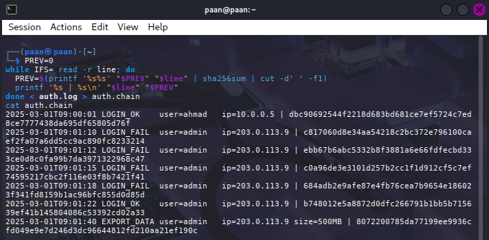

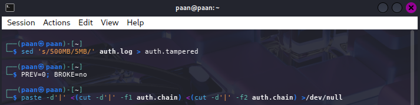

**Evidence placeholder:** Paste a screenshot of `auth.chain` and the proof that a modified log produces a different final hash.

### Task 5: Detect the Incident (Correlation)

#### Procedure

The security team correlates multiple events to detect a likely attack chain.

```bash
IP=203.0.113.9
FAILS=$(grep -c "LOGIN_FAIL.*$IP" auth.log)
SUCCESS=$(grep -c "LOGIN_OK.*$IP"  auth.log)
EXPORT=$(grep -c "EXPORT_DATA.*$IP" auth.log)
echo "IP=$IP fails=$FAILS success=$SUCCESS export=$EXPORT"

if [ "$FAILS" -ge 3 ] && [ "$SUCCESS" -ge 1 ] && [ "$EXPORT" -ge 1 ]; then
  echo 'ALERT: probable brute-force -> compromise -> data exfiltration';
fi
```

#### Result and observation

No single log line alone proved malicious intent. However, the combination of repeated failures, a successful login from the same IP and a large data export clearly matched a probable brute-force compromise followed by exfiltration.

#### Evidence

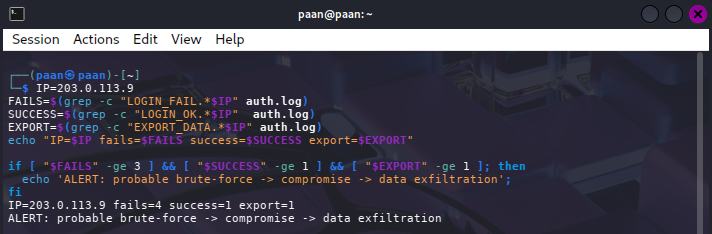

**Evidence placeholder:** Paste a screenshot showing `IP=203.0.113.9 fails=... success=... export=...` and the resulting `ALERT` output.

### Task 6: Incident Response

#### Procedure

The response lifecycle was executed in the lab: contain, collect evidence and document.

```bash
docker run --rm --cap-add=NET_ADMIN alpine sh -c \
  'apk add -q iptables; iptables -A INPUT -s 203.0.113.9 -j DROP; iptables -L INPUT -n | tail -2'

cp auth.log evidence_$(date +%Y%m%d).log
sha256sum evidence_*.log > evidence.sha256
cat evidence.sha256
```

#### Result and observation

The block rule served as containment, while the copied evidence and checksum provided a verifiable record of the forensic material. This mirrored the real-world incident-response sequence: detect, contain, preserve evidence and document.

#### Evidence

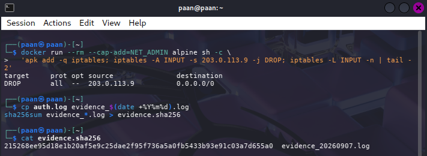

**Evidence placeholder:** Paste a screenshot of the `iptables` rule blocking the attacker IP and the generated `evidence.sha256` output.

---

## Deliverables & Assessment

### 1. Evidence
- The centralised `get-log-events` read-back from Task 2.
- The failed-login count grouped by IP from Task 3.
- The hash-chained log and proof that tampering changes the final hash from Task 4.
- The correlation `ALERT` output from Task 5.
- The containment rule and evidence hash file from Task 6.

### 2. Short-Answer Questions

**Q1. What is the difference between a log and an event? Give an example of each from this lab.**

A log is a durable record of an action or condition, while an event is a meaningful security trigger derived from one or more logs. For example, a `LOGIN_FAIL` entry is a log, while the alert “4 failed logins from 203.0.113.9 in 30 seconds” is an event.

**Q2. Why must audit logs be tamper-proof, and how does a hash chain achieve this?**

Audit logs must be tamper-proof because they are relied on as evidence during investigation, compliance review and legal or insurance disputes. A hash chain computes each entry from the previous hash, so if any log line is altered, the chain breaks and the final digest no longer matches the original chain.

**Q3. How did correlation detect an incident that no single log line revealed?**

A single log line only showed a failed login or a successful login. Correlation linked repeated failures from the same IP, a later success, and then a large export. Together those events formed a probable brute-force compromise followed by data exfiltration.

**Q4. List the incident-response steps you performed and the goal of each.**

- Detect: identify suspicious events.
- Contain: block the attacker IP.
- Collect evidence: preserve the log copy and hash.
- Document: record the timeline and findings.

**Q5. How do the same logs serve both security monitoring and compliance evidence?**

The same records can be used operationally for security monitoring and later as evidence for audits or compliance. The difference is intent: security monitoring uses them for detection and response, while compliance uses them to prove that controls and actions were logged and preserved.

### 3. Security Best-Practices Checklist

- [ ] Logs are centralised, not left scattered on each host.
- [ ] Security-relevant activity (failed logins) can be queried.
- [ ] Logs are tamper-evident (hash chain) and forwarded to a separate store.
- [ ] An incident is detected by correlating multiple events.
- [ ] Incident response performed: contain, collect evidence, document.

### 4. Verification Command

```bash
aws --endpoint-url=http://localhost:4566 logs describe-log-groups
sha256sum -c evidence.sha256
```

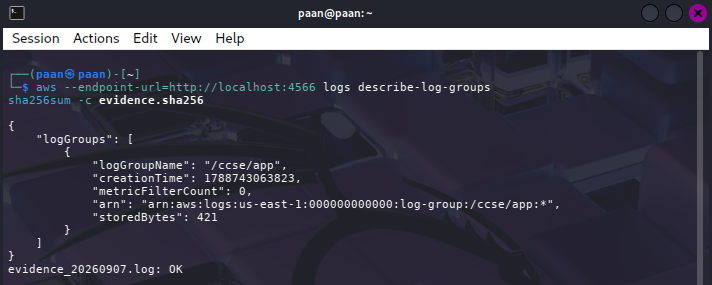

---

## Addendum: Management Plane Audit, Backup & the Restore Drill

### Why This Addendum Exists

Lab 5 taught how to collect and correlate application logs. This addendum covers the two things a cloud responder needs that application logs cannot give:

- The management-plane audit trail: who reconfigured the cloud itself.
- A tested recovery: backup is a claim, but restore is a measurement.

This addendum is supervised homework. Work through Tasks A1-A4 in your own time, keep the evidence and measured numbers, and be ready to defend the RTO and RPO figures.

### Task A1 — Reconstruct the Management Plane Audit Trail

#### Procedure

The LocalStack request log was used as the source of management-plane events. We created an audit bucket, recorded the baseline, then generated administrative activity such as bucket creation, user creation and attaching an admin policy.

```bash
docker rm -f localstack 2>/dev/null

docker run -d --name localstack -p 4566:4566 \
  -e LOCALSTACK_AUTH_TOKEN=$LOCALSTACK_AUTH_TOKEN \
  -e DEBUG=1 \
  localstack/localstack-pro:latest

until curl -sf http://localhost:4566/_localstack/health >/dev/null; do sleep 2; done

export EP='--endpoint-url=http://localhost:4566'
aws $EP sts get-caller-identity

aws $EP s3api create-bucket --bucket miit-audit-trail
aws $EP s3api put-bucket-versioning --bucket miit-audit-trail \
  --versioning-configuration Status=Enabled

BEFORE=$(docker logs localstack 2>&1 | wc -l)
echo "baseline: $BEFORE lines"

aws $EP s3api create-bucket --bucket miit-throwaway
aws $EP iam create-user --user-name TempContractor
aws $EP iam attach-user-policy --user-name TempContractor \
  --policy-arn arn:aws:iam::aws:policy/AdministratorAccess
aws $EP s3api delete-bucket --bucket miit-throwaway

docker logs localstack 2>&1 | tail -n +$((BEFORE+1)) \
  | grep -E 'AWS [a-z0-9-]+\.[A-Za-z]+ => ' > mgmt-trail.log
wc -l mgmt-trail.log

grep -E '\.(CreateUser|AttachUserPolicy|DeleteUser|CreateBucket|DeleteBucket|PutBucketPolicy|ScheduleKeyDeletion) =>' mgmt-trail.log

sha256sum mgmt-trail.log > mgmt-trail.sha256
cat mgmt-trail.sha256

aws $EP s3 cp mgmt-trail.log    s3://miit-audit-trail/
aws $EP s3 cp mgmt-trail.sha256 s3://miit-audit-trail/

grep -v 'AttachUserPolicy' mgmt-trail.log > t.log && mv t.log mgmt-trail.log

aws $EP s3 cp s3://miit-audit-trail/mgmt-trail.sha256 ./check.sha256
sha256sum -c check.sha256
```

#### Result and observation

The management-plane trail shows administrative control-plane actions that never appear in application logs. This is critical because actions such as attaching `AdministratorAccess` to a user happen at the cloud layer, not inside the workload. The SHA256 digest proves that if the audit record is modified, the tampering is immediately detectable.

#### Why this matters

The trail is written by the same platform that serves the API calls. This means the log is useful only if it is stored in a separate trust boundary, such as an S3 bucket outside the audited account. Otherwise an attacker with administrator rights may edit or delete the very log used to detect them.

#### Evidence

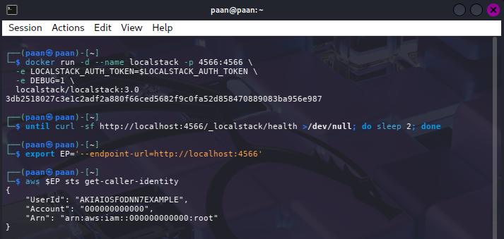

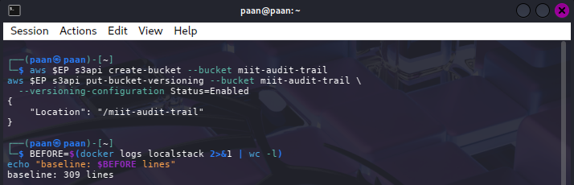

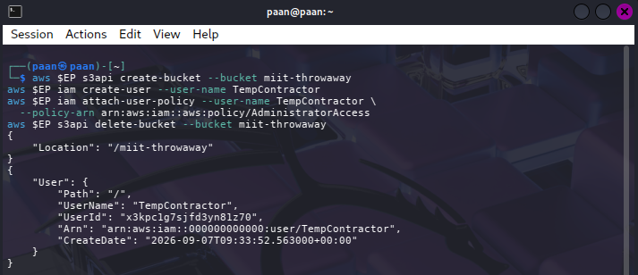

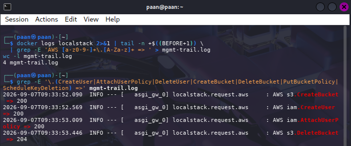

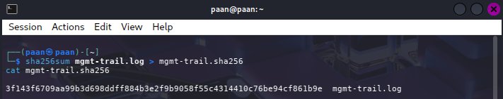

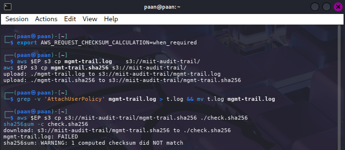

**Evidence placeholder:** Paste a screenshot showing the filtered management-plane trail, the sealed digest, and the failed verification after the log has been altered.

#### Short explanation for the CloudTrail-style record

A real CloudTrail record for `AttachUserPolicy` includes more than a platform request line because it includes user identity, account ID, source IP address, event time, AWS region, request parameters and metadata such as event ID. These fields let investigators establish who performed the action, from which source, when, what resource was targeted and whether it was a management event. If the same source IP also appears in the failed login attack from Lab 5, then the same threat actor is likely involved across both investigations: the brute-force attempt and the privilege escalation activity become one linked narrative.

A real deployment avoids a single point of failure by storing the audit trail in a separate trust boundary and by using append-only or immutable storage controls. The same management-plane trail must be protected with least privilege and separate retention, because an attacker who owns the control plane could otherwise disable or alter the logs.

### Task A2 — Backup, and Why Versioning Is Not One

#### Procedure

Create a primary bucket and a separate backup bucket, then enable versioning on both.

```bash
aws $EP s3api create-bucket --bucket miit-primary
aws $EP s3api create-bucket --bucket miit-dr-backup

aws $EP s3api put-bucket-versioning --bucket miit-primary \
  --versioning-configuration Status=Enabled
aws $EP s3api put-bucket-versioning --bucket miit-dr-backup \
  --versioning-configuration Status=Enabled

for i in $(seq 1 200); do
  echo "patient record $i - $(date)" > /tmp/rec$i.txt
done
aws $EP s3 sync /tmp/ s3://miit-primary/records/ --exclude '*' --include 'rec*.txt'

aws $EP s3 ls s3://miit-primary/records/ | wc -l
aws $EP s3 sync s3://miit-primary s3://miit-dr-backup
aws $EP s3 ls s3://miit-dr-backup/records/ | wc -l
```

#### Result and observation

Versioning protects objects within a bucket, but it does not replace a backup in a different trust boundary. If a bucket is deleted or an account is compromised, versioning alone may not be enough to preserve data.

**Important statement:** Versioning survives a single object delete or accidental overwrite; it does not survive a bucket deletion or a full compromise of the account holding the bucket.

#### Evidence

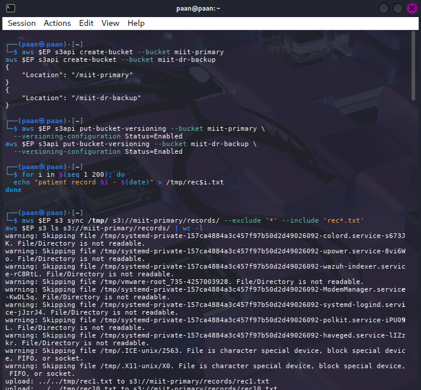

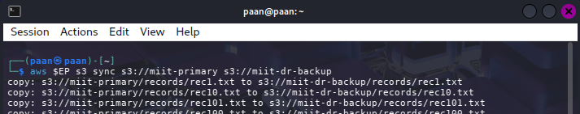

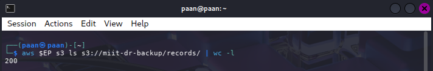

### Task A3 — The Restore Drill (Timed)

#### Procedure

Simulate a destructive incident, then restore from the backup and time the operation.

```bash
aws $EP s3 rm s3://miit-primary/records/ --recursive
aws $EP s3 ls s3://miit-primary/records/ | wc -l

START=$(date +%s)
aws $EP s3 sync s3://miit-dr-backup s3://miit-primary
END=$(date +%s)

echo "Objects restored: $(aws $EP s3 ls s3://miit-primary/records/ | wc -l)"
echo "MEASURED RTO (seconds): $((END - START))"
```

#### Result and observation

The measured recovery time depends on the dataset size and throughput. For a small lab dataset, the restore may take only a few seconds, but the real operational value comes from understanding how that translates at production scale.

| Measure | How it is obtained | Example/Your value |
|---------|--------------------|-------------------|
| **Measured RTO** | Elapsed seconds from the start to the end of the restore | Use your measured value from the lab |
| **Extrapolated RTO** | Scale the measured RTO to 1,000,000 objects | Use your estimate and state assumptions |
| **RPO** | Time between the last successful backup and the incident | Use the interval from your final sync to the destructive action |

**Security tip:** The assumption most likely to be wrong is that throughput scales linearly. In practice, network, storage and object-count overhead often make large restores slower than a simple linear estimate suggests.

#### Evidence

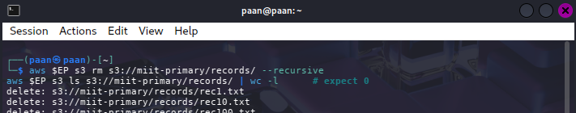

**Evidence placeholder:** Paste a screenshot of the `aws s3 sync` restore output and the `MEASURED RTO` line.

### Task A4 — Compare the Two Recovery Paths

#### Procedure

Run both recovery methods and compare them.

```bash
aws $EP s3api list-object-versions --bucket miit-primary \
  --prefix records/ --query 'length(DeleteMarkers)'

aws $EP s3api list-object-versions --bucket miit-primary \
  --prefix records/ --query 'length(Versions)'
```

#### Comparison table

| Recovery path | Recovery speed | Survives bucket deletion? | Survives compromised admin credential? | Survives KMS key destruction? | Cost profile |
|---------------|----------------|---------------------------|----------------------------------------|----------------------------------|-------------|
| **Versioning (in-place)** | Fast for recent deletes or overwritten objects | No | Often not, if the account or bucket is compromised | Usually not, if the key is destroyed or inaccessible | Lower operational cost, but weaker isolation |
| **Separate backup bucket** | Slower but more resilient | Yes | Yes, if the backup bucket is in a different trust boundary | Yes, if the backup key and bucket are independent | Higher storage cost, but stronger DR posture |

**Interpretation:** Versioning is useful for recovering a single deleted object, but a separate backup bucket is the stronger operational safeguard because it survives a broader failure domain.

#### Evidence

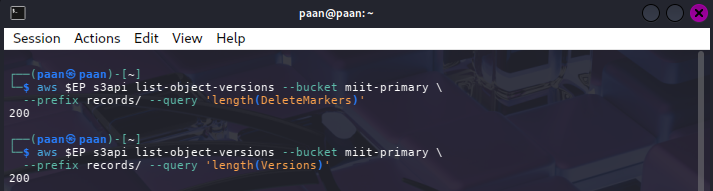

**Evidence placeholder:** Paste a screenshot showing the `list-object-versions` counts and your completed comparison table.

---

## Short-Answer Questions for the Addendum

**Q1. Name three administrative actions that would appear in a management plane trail but generate no application log at all. For each, state what an attacker gains by performing it.**

- Create user: attacker creates an alternate identity for persistence.
- Attach user policy: attacker grants administrative access or privileged permissions.
- Delete bucket: attacker removes evidence, backups or application data outside the workload.

**Q2. CloudTrail log file validation, the digest you sealed in Task A1, and the hash chain you built in Lab 5, Task 4 all solve the same problem by the same mechanism. Explain the mechanism and state why the digest must be written to a different trust boundary from the account it audits.**

The mechanism is file integrity validation: a cryptographic digest is generated from the original log and stored separately. If the log is altered, the digest mismatch reveals tampering. The digest must be written to a different trust boundary so an attacker cannot simply edit both the audit log and the digest file in the same place.

**Q3. Distinguish RTO from RPO using your own measured figures. Which is improved by taking backups more frequently, and which by restoring faster?**

RTO is the recovery time objective: how long it takes to restore service after a failure. RPO is the recovery point objective: how much data may be lost since the last backup. Taking backups more frequently improves RPO; restoring faster improves RTO.

**Q4. Your measured RTO was a few seconds. Explain why you should not report that number to a board, and what you would report instead.**

A lab-sized dataset is not representative of a production workload. The board needs a realistic estimate for the full business dataset, not just the training example, and should be given a scaled and validated measurement with stated assumptions and risk factors.

**Q5. Using your A4 table, state one incident that versioning survives and the separate backup does not, and one that the backup survives and versioning does not.**

- Versioning survives and the separate backup does not: a single accidental delete or overwrite inside the same bucket.
- The separate backup survives and versioning does not: bucket deletion or account compromise that removes the original bucket and its version history.

---

## Cleanup & Teardown

```bash
rm -f auth.log auth.chain auth.tampered evidence_*.log evidence.sha256
rm -f /tmp/rec*.txt mgmt-trail.log mgmt-trail.sha256 check.sha256

docker stop localstack && docker rm localstack
```

For the addendum, the cleanup also included deleting the backup and audit storage buckets, detaching the user policy and removing the test user, as specified in the lab guide.

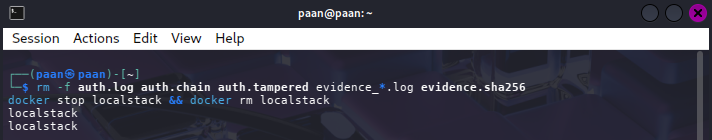

## References

- Course lecture — Week 6 (Monitoring, Auditing & Management)
- Course lecture — Week 2 (Security Design & Architecture)
- AWS CloudWatch Logs concepts — docs.aws.amazon.com/AmazonCloudWatch/latest/logs
- OWASP Logging Cheat Sheet — cheatsheetseries.owasp.org
- CSA Security Guidance v5 — Security Monitoring and Incident Response & Resilience
- AWS CloudTrail log file integrity validation — docs.aws.amazon.com/awscloudtrail/latest/userguide/cloudtrail-log-file-validation-intro.html

---

## Conclusion

This lab reinforced that monitoring and logging are not optional support functions; they are foundational to security operations and evidence integrity. By centralising logs, verifying tamper evidence, correlating indicators of compromise, and testing recovery procedures, the lab demonstrated how an organisation can detect, contain and recover from a real cloud incident with confidence and evidence.
