# Lab 6: Object Storage Security and the Data Security Lifecycle

## Student Information

- **Student Name:** Muhammad Afiq Farhan bin Mohd Nasaruddin
- **Course Code:** IKB42603 Cloud Computing Security Essentials
- **Lab Title:** Lab 6 - Object Storage Security and the Data Security Lifecycle
- **Lecturer:** Nor Adani Kamal Mohamad Nasir

---

**Topic:** Bucket exposure, resource policies, SSE-KMS, versioning and provable deletion  
**Tools:** Docker, LocalStack, AWS CLI, curl and Bash-compatible terminal

## Lab Learning Outcomes

At the end of this lab, I was able to:

1. Classify objects before storage and explain the security model of object storage.
2. Reproduce and remediate a publicly readable bucket.
3. Distinguish identity-based IAM policies from resource-based bucket policies.
4. Configure default SSE-KMS encryption and explain its security boundary.
5. Use presigned URLs for time-bounded delegated access.
6. Demonstrate versioning, delete markers, lifecycle retention and object-level remanence.
7. Explain cryptographic erasure as a method of provable deletion.

## Course and Assessment Mapping

| Item | Mapping |
|------|---------|
| **Course Learning Outcome** | CLO2 - Construct secure cloud operations that safeguard data confidentiality and integrity |
| **Lecture Topics** | Week 4 (Data Protection), Week 10 (Policy, Compliance & Risk) and Week 11 (Compliance Assessment & Reporting) |
| **Value/Skill Clusters** | VBE3 (Integrity) and SC8 (Integrated Problem-Solving) |
| **CSA CCSK v5 Domains** | Domain 5 (Data Security), Domain 4 (Organisation Management) and Domain 9 (Application Security) |
| **Assessment** | Lab report with outputs, screenshots, classification table and short answers |

## Lab Arrangement

| Session | Week | Focus |
|---------|------|-------|
| **Session A** | Week 11 | Object storage, data classification, public-bucket exposure, remediation and policy evaluation (Tasks 1-4) |
| **Session B** | Week 12 | Default encryption, presigned URLs, versioning, lifecycle and cryptographic erasure (Tasks 5-8) |

**Note:** Session A examined who can reach the data. Session B examined the state of the data: encrypted, shared, versioned, retained or destroyed.

---

## Introduction

This laboratory examined the security lifecycle of data stored in an Amazon S3-compatible object store. LocalStack was used to model bucket creation, object classification, public access, IAM and bucket policies, SSE-KMS encryption, presigned URLs, versioning, lifecycle configuration and key-based deletion.

The exercises used a sample hospital records bucket containing public, internal and confidential objects. The work first reproduced a public-bucket breach, then applied preventative access controls. It subsequently demonstrated that encryption, versioning and lifecycle rules address different risks and that deleting an object does not necessarily remove all recoverable versions.

## Environment and Preparation

The lab was executed with Docker, LocalStack and AWS CLI. LocalStack was started with IAM enforcement enabled:

```bash
docker rm -f localstack 2>/dev/null
docker run -d --name localstack -p 4566:4566 \
  -e LOCALSTACK_AUTH_TOKEN=$LOCALSTACK_AUTH_TOKEN \
  -e ENFORCE_IAM=1 \
  localstack/localstack-pro:latest

export EP='--endpoint-url=http://localhost:4566'
aws configure set aws_access_key_id test
aws configure set aws_secret_access_key test
aws configure set region us-east-1
aws $EP sts get-caller-identity
```

The bucket was created with a random suffix:

```bash
export BUCKET=miit-patient-records-$RANDOM
aws $EP s3api create-bucket --bucket "$BUCKET"
```

The three sample records represented different sensitivity levels:

```bash
echo 'Ward visiting hours 10am-8pm' > public-notice.txt
echo 'Staff duty schedule, week 12' > internal-roster.txt
echo 'Patient: Ahmad bin Ali, Diagnosis: confidential' > confidential-record.txt
```

The exact bucket name and KMS key ID used in the execution should be read from the terminal evidence and inserted wherever `$BUCKET` and `$KEY_ID` appear below.

**Evidence:**

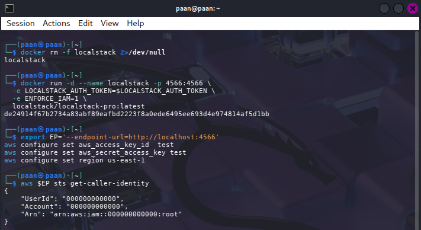

## Task 1: Classify the Data Before Storage

### Procedure

Each object was uploaded under a prefix, tagged with a classification and protected by an upload checksum:

```bash
aws $EP s3api put-object \
  --bucket "$BUCKET" \
  --key "public/notice.txt" \
  --body public-notice.txt \
  --tagging 'classification=public' \
  --checksum-algorithm CRC32
aws $EP s3api put-object \
  --bucket "$BUCKET" \
  --key "internal/roster.txt" \
  --body internal-roster.txt \
  --tagging 'classification=internal' \
  --checksum-algorithm CRC32
aws $EP s3api put-object \
  --bucket "$BUCKET" \
  --key "confidential/record.txt" \
  --body confidential-record.txt \
  --tagging 'classification=confidential' \
  --checksum-algorithm CRC32

aws $EP s3api list-objects-v2 --bucket "$BUCKET" \
  --query 'Contents[].[Key,Size]' --output table
aws $EP s3api get-object-tagging --bucket "$BUCKET" \
  --key confidential/record.txt
```

### Data classification table

| Classification | Who may read it | Impact if leaked | Control applied |
|----------------|-----------------|------------------|-----------------|
| **Public** | Patients, visitors and the general public | Low confidentiality impact; incorrect information could still cause confusion | Public content remains separately prefixed and is not granted access through a broad `/*` policy |
| **Internal** | Authorised hospital staff and approved services | Operational, privacy and safety impact | Least-privilege bucket policy scoped to `internal/*` |
| **Confidential** | Specifically authorised clinical staff and approved services | Serious privacy, legal and reputational impact under patient-data protection requirements | `confidential/*` is excluded from analyst access, protected with SSE-KMS, versioning and lifecycle controls |

Object storage uses a flat namespace. For example, `confidential/record.txt` is an object key; `confidential/` is not a real folder. Prefixes therefore need to be scoped carefully in policies.

### Result and observation

The list operation confirmed that the three objects existed and the tagging operation confirmed the confidential classification. The `CRC32` option added an integrity check during each upload, helping S3 detect accidental corruption in transit. Classification was performed before access decisions so that the later controls could be matched to the sensitivity of each object.

**Evidence:**

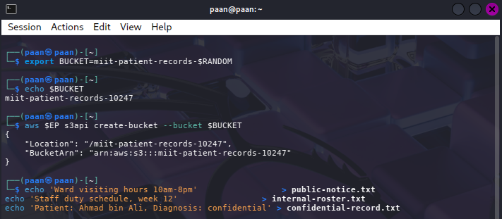

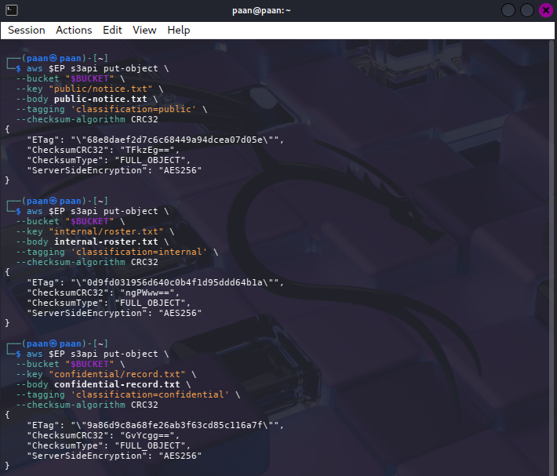

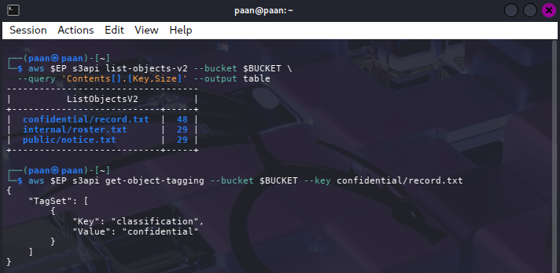

## Task 2: Reproduce the Public-Bucket Breach

### Procedure

A deliberately unsafe bucket policy granted object reads to every principal:

```bash
cat > public-policy.json <<JSON
{
  "Version": "2012-10-17",
  "Statement": [{
    "Sid": "PublicReadEverything",
    "Effect": "Allow",
    "Principal": "*",
    "Action": "s3:GetObject",
    "Resource": "arn:aws:s3:::$BUCKET/*"
  }]
}
JSON
```

After applying the policy, an anonymous HTTP request was made without AWS credentials:

```bash
aws $EP s3api put-bucket-policy --bucket "$BUCKET" --policy file://public-policy.json
curl -s -o leaked.txt -w 'HTTP %{http_code}\n' \
  "http://localhost:4566/$BUCKET/confidential/record.txt"
cat leaked.txt
```

### Result and observation

The anonymous request returned the confidential patient record with HTTP 200. This reproduced the breach without exploiting software: the bucket policy itself authorised every principal. The single element that caused the exposure was `"Principal": "*"`. Because the resource was `BUCKET/*`, that public principal received read access to every object in the bucket, including the confidential prefix.

**Evidence:**

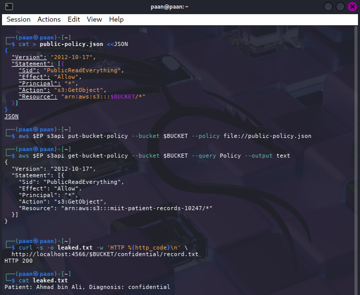

## Task 3: Remediate with Block Public Access

### Procedure

The unsafe policy was removed and all four Block Public Access settings were enabled:

```bash
aws $EP s3api delete-bucket-policy --bucket "$BUCKET"
aws $EP s3api put-public-access-block --bucket "$BUCKET" \
  --public-access-block-configuration \
  BlockPublicAcls=true,IgnorePublicAcls=true,BlockPublicPolicy=true,RestrictPublicBuckets=true

aws $EP s3api get-public-access-block --bucket "$BUCKET"
```

A least-privilege policy was then applied to the internal prefix:

```bash
cat > least-privilege-policy.json <<JSON
{
  "Version": "2012-10-17",
  "Statement": [{
    "Sid": "AccountReadInternalOnly",
    "Effect": "Allow",
    "Principal": {"AWS": "arn:aws:iam::000000000000:root"},
    "Action": "s3:GetObject",
    "Resource": "arn:aws:s3:::$BUCKET/internal/*"
  }]
}
JSON
```

### Result and observation

The four settings were recorded as enabled. On real AWS, `BlockPublicPolicy=true` rejects a bucket policy that attempts to make the bucket public, while the other settings prevent public ACLs or restrict public bucket access. LocalStack stores this configuration faithfully but may not enforce every public-access decision in the same way as AWS. Therefore, the configuration output is the authoritative lab evidence when the anonymous retest still returns HTTP 200.

Block Public Access is a preventative guardrail because it stops a dangerous policy or ACL from being introduced. A detective control would only report that exposure after it exists. Preventative controls are especially important in organisations with many engineers because they reduce dependence on every individual remembering the correct policy.

**Evidence:**

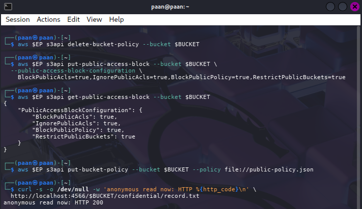

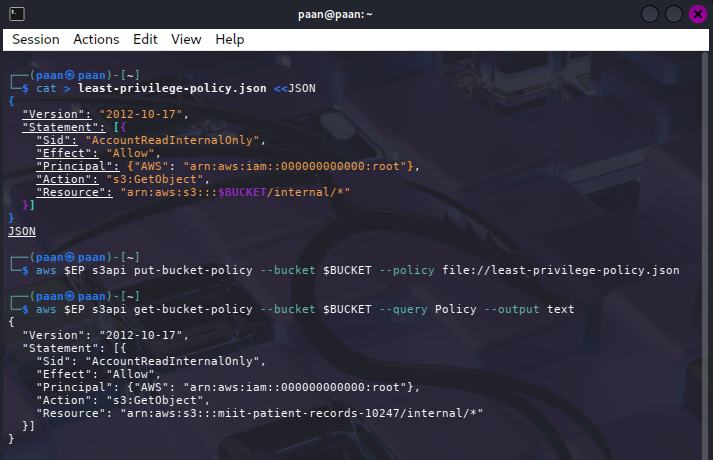

## Task 4: Identity Policy versus Resource Policy

### Procedure

An IAM user named `DataAnalyst` was created with an identity policy allowing S3 reads:

```bash
aws $EP iam create-user --user-name DataAnalyst

cat > analyst-iam.json <<'JSON'
{
  "Version": "2012-10-17",
  "Statement": [{
    "Effect": "Allow",
    "Action": ["s3:GetObject", "s3:ListBucket"],
    "Resource": "*"
  }]
}
JSON

aws $EP iam put-user-policy --user-name DataAnalyst \
  --policy-name S3ReadAll --policy-document file://analyst-iam.json
aws $EP iam create-access-key --user-name DataAnalyst \
  --query 'AccessKey.[AccessKeyId,SecretAccessKey]' --output text

ANALYST_KEY_ID='PASTE_KEY_ID_HERE'
ANALYST_SECRET='PASTE_SECRET_HERE'

aws configure --profile analyst set aws_access_key_id     "$ANALYST_KEY_ID"
aws configure --profile analyst set aws_secret_access_key "$ANALYST_SECRET"
aws configure --profile analyst set region us-east-1
```

The bucket policy allowed the analyst to read `internal/*` but explicitly denied all S3 actions on `confidential/*`:

```bash
cat > deny-confidential.json <<JSON
{
  "Version": "2012-10-17",
  "Statement": [
    {
      "Sid": "AllowAnalystInternal",
      "Effect": "Allow",
      "Principal": {"AWS": "arn:aws:iam::000000000000:user/DataAnalyst"},
      "Action": "s3:GetObject",
      "Resource": "arn:aws:s3:::$BUCKET/internal/*"
    },
    {
      "Sid": "DenyAnalystConfidential",
      "Effect": "Deny",
      "Principal": {"AWS": "arn:aws:iam::000000000000:user/DataAnalyst"},
      "Action": "s3:*",
      "Resource": "arn:aws:s3:::$BUCKET/confidential/*"
    }
  ]
}
JSON

aws $EP s3api put-bucket-policy --bucket $BUCKET --policy file://deny-confidential.json
```

The two requests were tested with the analyst profile:

```bash
AWS_PROFILE=analyst aws $EP s3api get-object \
  --bucket $BUCKET --key internal/roster.txt analyst-internal.txt && echo "internal: ALLOWED"

AWS_PROFILE=analyst aws $EP s3api get-object \
  --bucket $BUCKET --key confidential/record.txt analyst-conf.txt || echo "confidential: DENIED"
```

### Result and observation

The internal read was allowed because the IAM policy and the bucket policy both allowed it. The confidential read was denied because the explicit bucket-policy `DenyAnalystConfidential` statement overrides the broad IAM allow. The evaluation order is default deny, then any explicit deny, then an applicable allow. If LocalStack does not enforce IAM in the environment, the policy documents and this evaluation logic are the required evidence.

An identity-based policy is attached to a user, group or role and states what that identity may do. A resource-based policy is attached to the bucket and states which principals may access that resource. Both policies must permit a request, but an explicit deny overrides an allow.

**Evidence:**

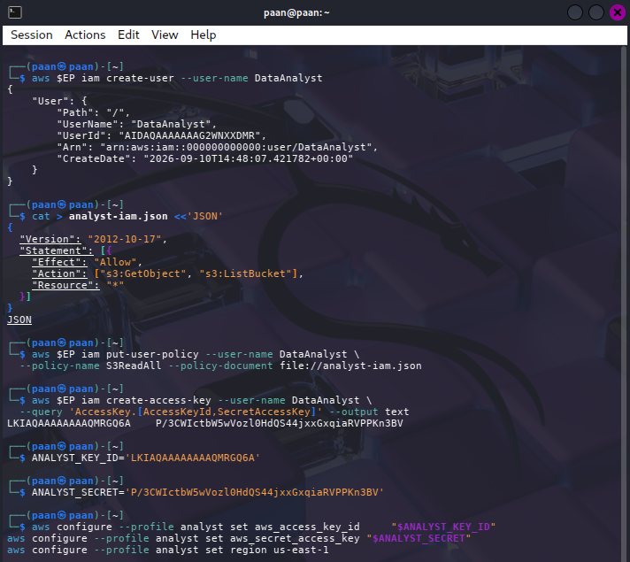

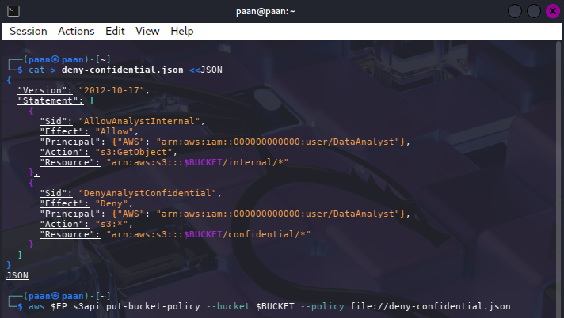

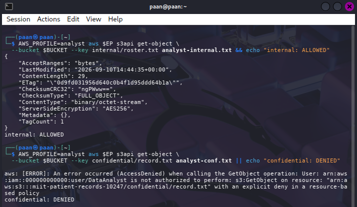

## Task 5: Default Encryption at Rest with SSE-KMS

### Procedure

A dedicated KMS key was created and configured as the bucket's default encryption key:

```bash
export KEY_ID=$(aws $EP kms create-key \
  --description 'IKB42603 Lab6 patient records bucket key' \
  --query 'KeyMetadata.KeyId' --output text)
echo $KEY_ID
 
cat > encryption.json <<JSON
{
  "Rules": [{
    "ApplyServerSideEncryptionByDefault": {
      "SSEAlgorithm": "aws:kms",
      "KMSMasterKeyID": "$KEY_ID"
    },
    "BucketKeyEnabled": true
  }]
}
JSON
 
aws $EP s3api put-bucket-encryption --bucket $BUCKET \
  --server-side-encryption-configuration file://encryption.json
aws $EP s3api get-bucket-encryption --bucket $BUCKET
```

An object was uploaded without encryption flags, allowing the bucket default to apply:

```bash
aws $EP s3api put-object --bucket $BUCKET \
  --key confidential/record-v2.txt --body confidential-record.txt
aws $EP s3api head-object --bucket $BUCKET --key confidential/record-v2.txt \
  --query '[ServerSideEncryption,SSEKMSKeyId,BucketKeyEnabled]' --output text
```

### Result and observation

The `head-object` output showed `aws:kms`, the dedicated key ID and bucket-key status. This proved that default encryption protected an upload even when the uploader did not supply encryption parameters. `BucketKeyEnabled=true` reduces KMS request volume by reusing an envelope-encryption data key pattern across objects; it does not reduce the confidentiality requirement.

SSE-KMS protects data at rest from unauthorised access to the underlying storage and gives the organisation control and auditability over key use. It does not decide whether the analyst is authorised to call S3, does not replace IAM or bucket policies, and does not stop an already authorised reader from receiving decrypted data through S3.

**Evidence:**

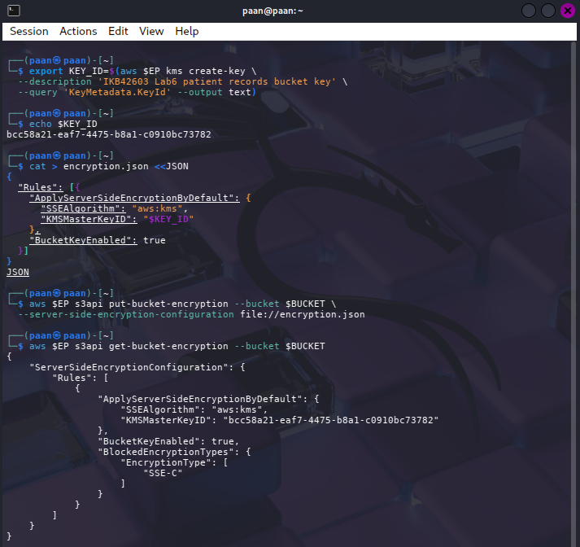

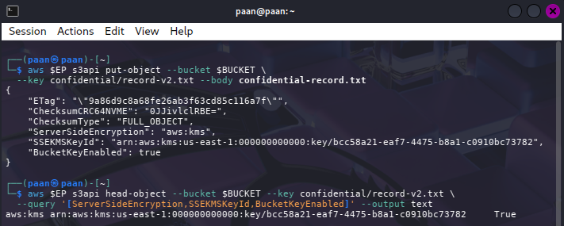

## Task 6: Presigned URLs and the Condition-Key Trap

### Presigned URL

A URL for one object was generated with a 60-second lifetime:

```bash
URL=$(aws $EP s3 presign "s3://$BUCKET/internal/roster.txt" --expires-in 60)
curl -s -w '  <-- HTTP %{http_code}\n' "$URL"
```

The URL contains a signature and an expiry value such as `X-Amz-Expires` (or the equivalent `Expires` parameter). The signature binds the request to the signing credentials, HTTP method, target object and request parameters. The expiry value limits the validity period. Anyone who obtains the URL before expiry can use it as the authorised bearer of that delegated access, so it must be treated as a secret. LocalStack may not enforce expiry consistently; when that happens, the URL structure and intended AWS behaviour provide the evidence.

### Secure transport policy

The following policy was applied:

```bash
cat > secure-transport.json <<JSON
{
  "Version": "2012-10-17",
  "Statement": [{
    "Sid": "DenyUnencryptedTransport",
    "Effect": "Deny",
    "Principal": "*",
    "Action": "s3:*",
    "Resource": ["arn:aws:s3:::$BUCKET", "arn:aws:s3:::$BUCKET/*"],
    "Condition": {"Bool": {"aws:SecureTransport": "false"}}
  }]
}
JSON

```

The policy was tested and then removed:

```bash
aws $EP s3api put-bucket-policy --bucket "$BUCKET" --policy file://secure-transport.json
aws $EP s3api list-objects-v2 --bucket "$BUCKET"
aws $EP s3api delete-bucket-policy --bucket "$BUCKET"
```

### Result and observation

The LocalStack endpoint was plain HTTP, so `aws:SecureTransport` evaluated to false and the explicit deny could lock out ordinary requests. This policy is correct for an HTTPS AWS endpoint, where normal requests make the condition false only when transport is genuinely insecure. A condition key must be evaluated in the environment where the policy will run; otherwise a sound production control can deny every request in a test environment.

**Evidence:**

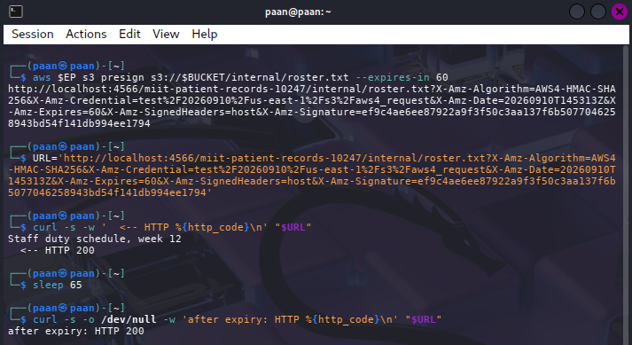

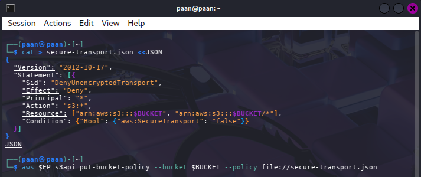

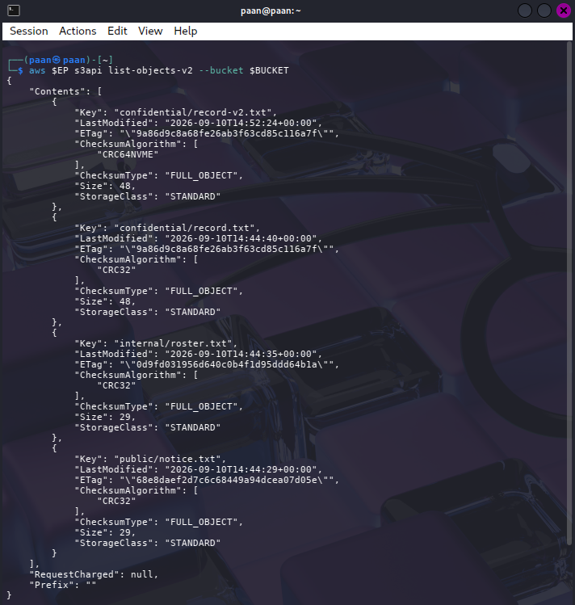

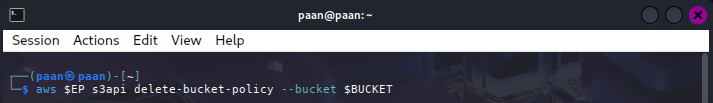

## Task 7: Versioning, Delete Markers and Data Remanence

### Procedure

Versioning was enabled and two revised versions of the record were uploaded:

```bash
aws $EP s3api put-bucket-versioning --bucket $BUCKET \
  --versioning-configuration Status=Enabled

aws $EP s3api put-object --bucket $BUCKET --key confidential/record.txt \
  --body rec-v2.txt --query VersionId --output text
aws $EP s3api put-object --bucket $BUCKET --key confidential/record.txt \
  --body rec-v3.txt --query VersionId --output text

aws $EP s3api list-object-versions --bucket $BUCKET \
  --prefix confidential/record.txt \
  --query 'Versions[].[VersionId,IsLatest,Size]' --output table
```

The object was then deleted normally and the versions were inspected:

```bash
aws $EP s3api delete-object --bucket $BUCKET --key confidential/record.txt

aws $EP s3api list-object-versions --bucket $BUCKET \
  --prefix confidential/record.txt \
  --query 'DeleteMarkers[].[VersionId,IsLatest]' --output table

aws $EP s3api get-object --bucket $BUCKET \ 
  --key confidential/record.txt gone.txt

aws $EP s3api get-object --bucket $BUCKET \
  --key confidential/record.txt --version-id null recovered.txt
cat recovered.txt
```

### Result and observation

The normal delete created a delete marker, making the object appear absent to an ordinary reader. The earlier versions remained underneath it, including the original unredacted record. The recovered file therefore demonstrated object-level data remanence. In a versioned bucket, `delete-object` without a version ID does not destroy all data.

Permanent removal requires deleting every object version and every delete marker by ID. This is necessary when responding to a patient erasure request under a privacy regime such as the PDPA or GDPR.

**Evidence:**

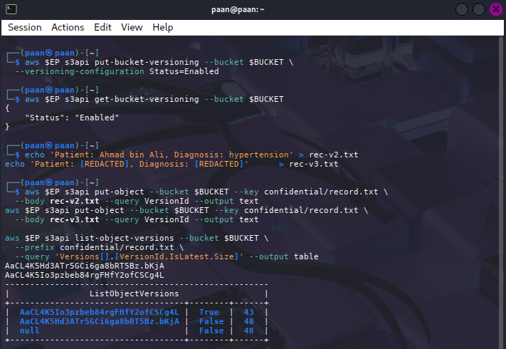

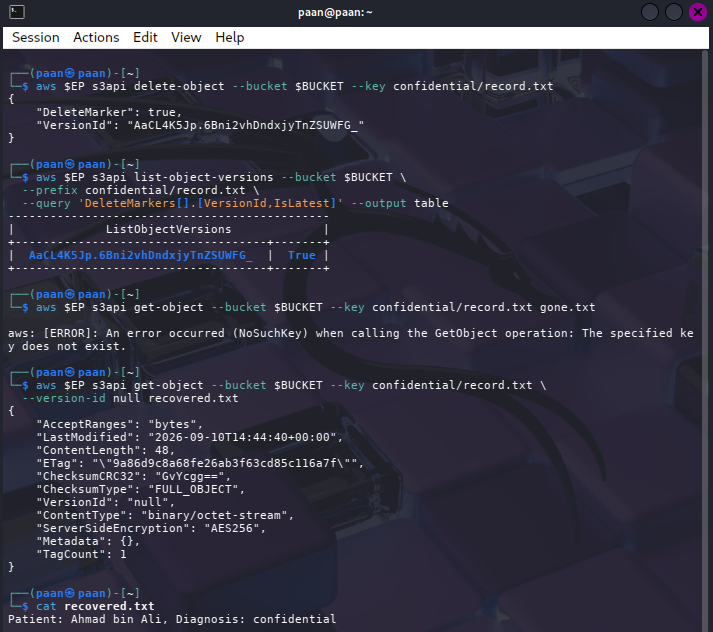

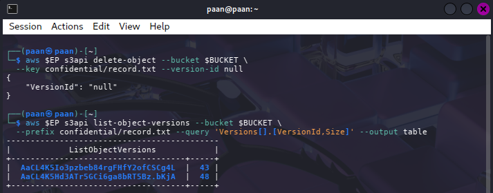

## Task 8: Lifecycle, Retention and Cryptographic Erasure

### Lifecycle configuration

A lifecycle policy was applied to automate retention:

```bash
cat > lifecycle.json <<'JSON'
{
  "Rules": [
    {
      "ID": "RetireConfidentialRecords",
      "Filter": {"Prefix": "confidential/"},
      "Status": "Enabled",
      "Expiration": {"Days": 365},
      "NoncurrentVersionExpiration": {"NoncurrentDays": 30}
    },
    {
      "ID": "AbortIncompleteUploads",
      "Filter": {"Prefix": ""},
      "Status": "Enabled",
      "AbortIncompleteMultipartUpload": {"DaysAfterInitiation": 7}
    }
  ]
}
JSON
```

The configuration was verified with:

```bash
aws $EP s3api put-bucket-lifecycle-configuration --bucket "$BUCKET" \
  --lifecycle-configuration file://lifecycle.json
aws $EP s3api get-bucket-lifecycle-configuration --bucket "$BUCKET" \
  --query 'Rules[].[ID,Status]' --output table
```

The first rule expires confidential objects after 365 days and noncurrent versions after 30 days. The second rule removes incomplete multipart uploads after seven days. This makes the retention policy automated and auditable.

### Cryptographic erasure

The KMS key state was inspected, disabled and scheduled for deletion:

```bash
aws $EP kms describe-key --key-id "$KEY_ID" \
  --query 'KeyMetadata.[KeyId,KeyState,Enabled]' --output text
aws $EP kms disable-key --key-id "$KEY_ID"
aws $EP kms schedule-key-deletion --key-id "$KEY_ID" --pending-window-in-days 7
aws $EP kms describe-key --key-id "$KEY_ID" \
  --query 'KeyMetadata.[KeyState,DeletionDate]' --output text

# Attempt to read an object encrypted under the disabled key
aws $EP s3api get-object --bucket $BUCKET \
  --key confidential/record-v2.txt after-erasure.txt
```

An object encrypted under the key was then tested. If LocalStack still returned the object, the KMS-level encrypt, disable and decrypt sequence was used to demonstrate the failed key operation instead.

Cryptographic erasure is stronger than physical overwriting in cloud storage because the customer cannot inspect every replica, backup or physical disk. Destroying the key that protects the ciphertext makes all copies computationally unusable, provided no usable copy of the key exists elsewhere and the key-deletion process is properly controlled and audited.

**Evidence:**

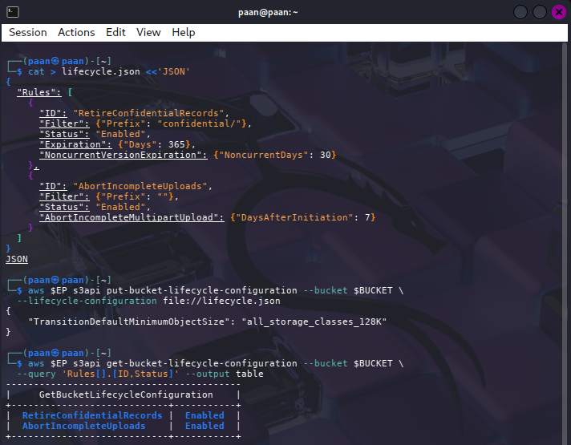

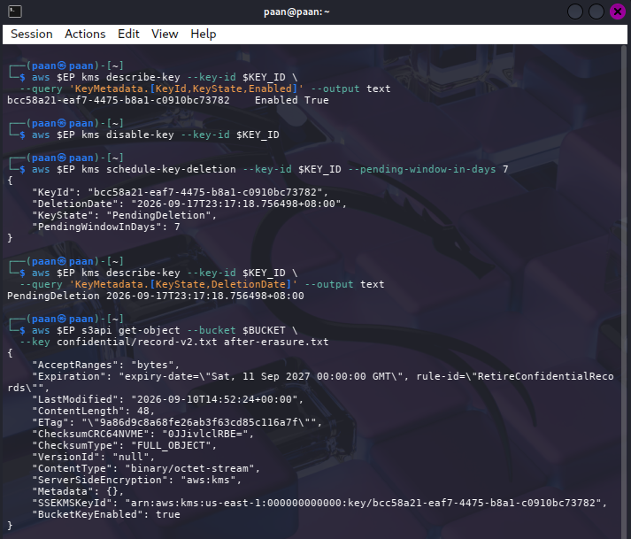

## Short-Answer Questions

### Q1. Which policy element caused the Task 2 exposure?

`"Principal": "*"` caused the exposure because it granted the action to every principal, including anonymous callers. It was especially dangerous because the resource was `BUCKET/*`, covering every object. An over-broad IAM policy attached to one user affects one identity, while a public bucket resource policy can expose data to anyone on the network.

### Q2. How do identity and resource policies differ?

An identity-based policy is attached to a user, group or role and defines what that identity may do. A resource-based policy is attached to the bucket and defines which principals may access the resource. In Task 4, the internal request was decided by the applicable allows in both policies. The confidential request was decided by the explicit `DenyAnalystConfidential` bucket statement, which overrode the analyst's IAM allow.

### Q3. Why is Block Public Access a guardrail?

A control describes a desired protection, while a guardrail constrains actions so that a dangerous state cannot easily be created. Block Public Access prevents public ACLs and public policies from opening the bucket. This matters in a large organisation because the guardrail reduces the chance that one engineer's configuration mistake becomes a data breach; a detective alert would only identify the problem after exposure existed.

### Q4. Does SSE-KMS protect the record from the analyst?

Not by itself. SSE-KMS protects the object while stored and controls the key operation used by the storage service. When S3 authorises a legitimate `GetObject` request, it can decrypt the object for that caller. The analyst must therefore be blocked by IAM and bucket-policy authorisation. Encryption at rest does not replace least-privilege access control.

### Q5. Why is delete-object alone not compliant, and how can deletion be proven?

With versioning enabled, a normal delete creates a delete marker while earlier versions remain recoverable. Task 7 recovered the original diagnosis by requesting the old version. Two stronger mechanisms are: (1) enumerate and delete every object version and delete marker, retaining the version-list and deletion outputs as evidence; and (2) use cryptographic erasure by disabling or permanently deleting the KMS key, then retain the KMS state and failed decrypt evidence. Lifecycle expiration can automate the first mechanism but should still be audited.

### Q6. Which commands provide compliance evidence?

1. `get-public-access-block` evidences the four preventative public-access settings.
2. `head-object` evidences that an object uses `aws:kms` and the intended customer-managed key.
3. `get-bucket-lifecycle-configuration` evidences the approved retention and incomplete-upload rules.

Other useful evidence includes `list-object-versions` for remanence and `kms describe-key` for cryptographic-erasure state.

## Final Verification

The following block verifies the final security posture of the bucket:

```bash
echo "=== IKB42603 Lab 6 verification: $BUCKET ==="
aws $EP s3api get-public-access-block --bucket $BUCKET \
  --query 'PublicAccessBlockConfiguration' --output text
aws $EP s3api get-bucket-versioning --bucket $BUCKET --output text
aws $EP s3api get-bucket-encryption --bucket $BUCKET \
  --query 'ServerSideEncryptionConfiguration.Rules[0].ApplyServerSideEncryptionByDefault.[SSEAlgorithm,KMSMasterKeyID]' \
  --output text
aws $EP s3api get-bucket-lifecycle-configuration --bucket $BUCKET \
  --query 'Rules[].[ID,Status]' --output text
aws $EP kms describe-key --key-id $KEY_ID \
  --query 'KeyMetadata.KeyState' --output text
```

**Evidence:**

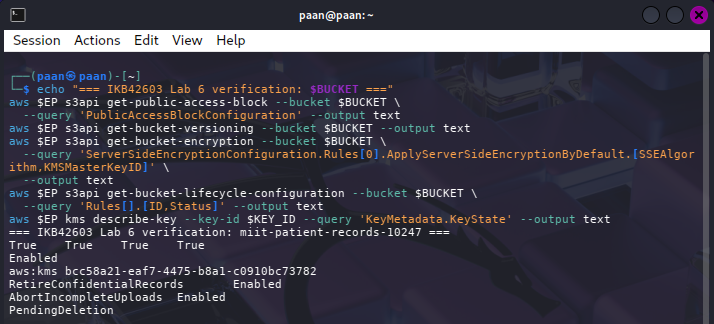

## Security Best-Practices Checklist

- [x] Every object was assigned a classification tag before access decisions.
- [x] The public policy was reproduced, identified and removed.
- [x] Block Public Access was configured with all four flags enabled.
- [x] Access was scoped to a key prefix rather than granted to `/*` by default.
- [x] Default encryption used `aws:kms` with a customer-managed key.
- [x] Delegated sharing used a time-bounded presigned URL.
- [x] Versioning was enabled and delete-marker remanence was demonstrated.
- [x] Lifecycle rules expressed retention and incomplete-upload cleanup.
- [x] KMS key disablement and deletion scheduling demonstrated cryptographic erasure.

## Cleanup and Teardown

A versioned bucket must be emptied by deleting every object version and delete marker before the bucket can be removed:

```bash
aws $EP s3api delete-bucket-policy --bucket "$BUCKET"
aws $EP s3api delete-objects --bucket "$BUCKET" --delete "$(aws $EP s3api \
  list-object-versions --bucket "$BUCKET" --output json \
  --query '{Objects: Versions[].{Key:Key,VersionId:VersionId}}')"
aws $EP s3api delete-objects --bucket "$BUCKET" --delete "$(aws $EP s3api \
  list-object-versions --bucket "$BUCKET" --output json \
  --query '{Objects: DeleteMarkers[].{Key:Key,VersionId:VersionId}}')"
aws $EP s3api delete-bucket --bucket "$BUCKET"
aws $EP iam delete-user-policy --user-name DataAnalyst --policy-name S3ReadAll
aws $EP iam delete-user --user-name DataAnalyst
docker rm -f localstack
rm -f *.json *.txt
```

Deleting every version and marker is necessary because `s3 rb --force` does not remove all historical versions from a versioned bucket.

## Conclusion

This lab demonstrated that object-storage security requires layered controls across the entire data lifecycle. Classification and prefix-scoped policies limited access, while Block Public Access reduced configuration risk. IAM and bucket policies worked together, with explicit deny taking precedence. SSE-KMS protected data at rest but did not replace authorisation. Presigned URLs enabled controlled temporary sharing, while versioning showed why an apparent delete may leave sensitive data recoverable. Lifecycle policies automated retention, and KMS-based cryptographic erasure provided a stronger deletion assurance when physical copies could not be inspected directly.

## References

- IKB42603 Cloud Computing Security Essentials, Lab 6 manual, UniKL MIIT.
- [Amazon S3 security best practices](https://docs.aws.amazon.com/AmazonS3/latest/userguide/security-best-practices.html)
- [Amazon S3 versioning](https://docs.aws.amazon.com/AmazonS3/latest/userguide/Versioning.html)
- [LocalStack S3 coverage and limitations](https://docs.localstack.cloud/references/coverage/)
- Cloud Security Alliance, *Security Guidance v5*, Data Security.
